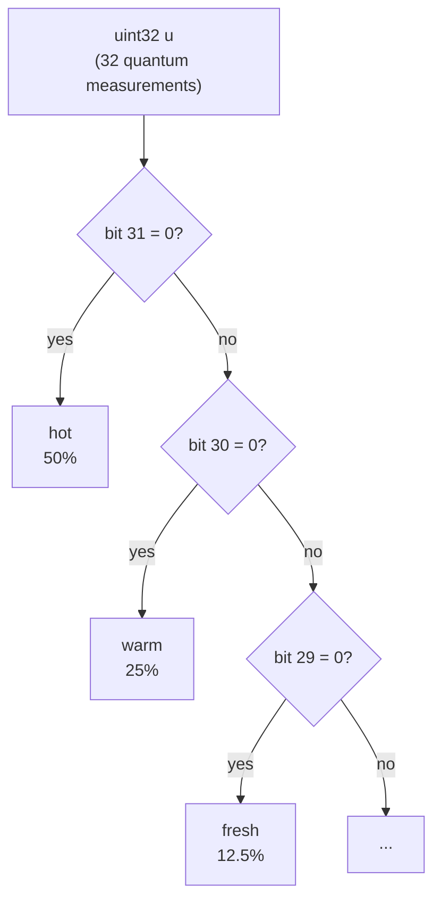
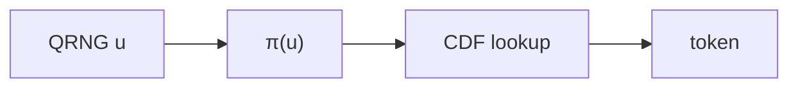
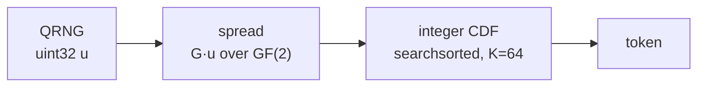

> Note: This is going to be my ***Voight-Kampff Test***, either you will think this whole project is freaking amazing, or the dumbest shit you have ever read. Nothing in between. Just the way I like it.

Someone recently released [quantum-llama.cpp](https://forum.mindmatterinteraction.net/t/introducing-quantum-llama-cpp-qrng-powered-llm-token-sampling/339), a fork of standard Llama inference that swaps the pseudorandom number generator for a quantum one. The author called it "*allowing the universe itself to co-author the output.*"

Your regular, garden-variety nerd might have happened to stumble on this 'quantum woo' article, and think "That doesn't make too much sense, but isn’t quantum randomness just a fancy random-number generator?". I read it and thought about OpenClaw, photomultiplier tubes and FPGAs.

OpenClaw is an agent harness. ReAct loop, tool calls, the usual. You give it a goal and it reasons, acts, observes, and reasons again until something stops it or it *runs out of money*. The interesting thing about an agent harness is that the same probability distribution that picks the next word also picks the next tool call to use. Reasoning and action come out of the same sampler. **WTF is a sampler?** Well, at every step, your LLM doesn't generate the next word. It actually generates a list of probabilities *for all possible* next words. Then, we pick the next word using those probabilities (*don't worry, we will go over the math in too much detail later!*).

Back to Quantum Random Number Generators ([QRNGs](https://en.wikipedia.org/wiki/Hardware_random_number_generator#Quantum-based_RNG)): Under the 'Many-Worlds' interpretation (MWI), a quantum random draw doesn't pick one outcome. The wave function never collapses. Every outcome with non-zero amplitude happens in some decohered branch. So if a photon's path picks the next token, or the next token in a tool call, ***the LLM stops being a text generator and becomes a steering wheel for which branch of the universe you end up in***. Especially so when the LLM has agency and takes actions on your behalf.

> And before you draft an email about the measure problem: pause. The measure problem is metaphysical and the rig is engineering. The photons hit the detectors, and steer OpenClaw: Whether you choose to interpret that via Many-Worlds, Copenhagen, or consistent histories is up to you. *I choose interesting*.

I had to build my own. This will be an exploration in optics, single photon pulse detection, FPGA circuits hardcoding von Neumann and Peres debiasing (*plus Toeplitz-hashing extractors*), the geometry of LLM logit distribution, and how this comes together and gets pushed to my [GH200 box](/posts/hopper) running MiniMax M2.7 via custom fork of [llama.cpp](https://github.com/ggml-org/llama.cpp) with a custom quantum-aware sampler. And I didn't want to just generate text. ***I wanted to hand Quantum OpenClaw fifty bucks and an API key to Polymarket and tell it to trade prediction markets.***

Here is the whole machine in one breath:

```mermaid
flowchart LR
    P["photon<br/>path"] --> M["PMT<br/>pulse"]
    M --> F["FPGA<br/>bitstream"]
    F --> S["spreader<br/>diffuse address"]
    S --> Q["quantum-aware<br/>sampler"]
    Q --> T["token"]
    T --> C["tool call"]
    C --> O["market order"]

    click P "#phase-1-building-the-beam-universe-splitter" "Phase 1: optics and PMTs"
    click M "#phase-1-building-the-beam-universe-splitter" "Phase 1: optics and PMTs"
    click F "#circuit-overview" "FPGA circuit overview"
    click S "#phase-5-spreading-the-quantum-goodness" "Phase 5: spreader"
    click Q "#phase-6-the-quantum-sampler-finally" "The quantum sampler"
    click T "#phase-3-the-model-is-the-lens" "Phase 3: model as lens"
    click C "#tool-call" "Tool call"
    click O "#market-order" "Market order"
```

The first half is the bench rig: [photons and PMTs](#phase-1-building-the-beam-universe-splitter), then the [FPGA circuit](#circuit-overview). The second half is the sampler: the model lens, the [probability floor](#phase-4-the-multiverse-has-a-resolution-limit), the [spreader](#phase-5-spreading-the-quantum-goodness), and the [quantum-aware CDF lookup](#phase-6-the-quantum-sampler-finally). The last two steps are where this stops being a random number generator and becomes an agent: [tool call](#tool-call), then [market order](#market-order).

> Here's the hardware build-log, why standard LLM samplers murder most of the multiverse, how your gonads are a worse Quantum Lever than my rig, and what happens when you give quantum uncertainty a credit card.

---

## Phase 1: Building the ~~Beam~~ Universe Splitter

*Doesn't a normal computer already do this?* `/dev/urandom` pulls from an OS entropy pool, ultimately seeded by physical noise sources that are quantum at the bottom. (*waves to NSA* [👋🏻😅](https://en.wikipedia.org/wiki/Dual_EC_DRBG)).

Yes, but only once. A *Pseudorandom Number Generator* (PRNG) seeded from OS entropy makes one quantum draw at the seed, then runs deterministically forever after. A QRNG generates fresh physical entropy at every sampling step, and although you won't find much of a difference between the two statistically, they have vastly different properties in the most important aspect of all: ***philosophically***. 

**And to be clear: none of this is a quantum computer.** There are no entangled states, no superposition of token sequences, no Grover's algorithm searching the multiverse for the winning trade. The rig is a classical pipeline driven by single-event quantum measurements. Each time a token is generated by the connected LLM, it was selected *based on whether single photons were detected by either a left or right path to some photomultiplier tubes.* The branching happens because every measurement decoheres into its own world, not because anything is being *computed in parallel*.

### List of Ingredients
OK, let's back up a bit. To build what I'll call a **Quantum Lever**, you'll need three household items:

1. A quantum input: Photon paths, radioactive decays etc.
2. A high-gain amplifier ($>10^{6}$). PMT dynodes, Geiger–Müller tubes, avalanche photodiode etc.
3. A causal fork. Some downstream system whose behaviour depends on the amplified signal. The bigger the impact, *the larger the lever*

Most quantum events go nowhere. They happen, decohere, and the universe forgets. Step outside on a sunny day and pick up a warm rock. Countless photons have struck it, each striking a precise place and at atomic resolution in each branch of the multiverse, but that information has long since dispersed into featureless heat: a multiverse of inconsequence. Quantum Levers are the rare arrangements in which the microscopic does not vanish into the background, but reaches up and moves the macroscopic.

In my first attempt to harness the quantum realm, I messed about with a gem in my lens collection: an early Canon FD 55mm F1.2 Aspherical lens, with a rear element made with thoriated glass. Hold a Geiger counter to it and it makes you wonder if holding a camera to your eye with this beast mounted is really such a great idea (*but OMG, the **Bokeh**...*).

But I didn't like it conceptually. Sure, the time between counts is random, but not the cool kind of random I wanted. Timing between the pulses and taking the least significant bit *is random*, but not sexy random. I wanted a proper quantum coin flip.

What was missing was inorganic, raised free-range photons. The final rig uses the canonical setup, using a pair of photomultiplier tubes (PMTs) to measure the 'coin flips':

1. Attenuate a light source until photons arrive one-at-a-time.
2. Send them at a 50:50 beam splitter.
3. Photons 'choose' to go *through* the mirror and hit PMT A; or *bounce off* the mirror and hit PMT B.

If PMT A fires, it's a 0. If PMT B fires, it's a 1.  We see which universe we reside in by measuring which path they 'chose'. Simple and elegant.  Except it needs a *lot* of engineering (*but that's why you're here, right?*).

A friend gave me a pair of Hamamatsu photomultiplier tubes (PMTs).  These came from the core of a nano differential scanning fluorimetry, and were used to analyse protein structure via tryptophan fluorescence, which absorbs light at 280 nm. Like most fluorophores, its emission properties change depending on its chemical environment. When the proteins are all nicely folded up, and the tryptophans are nestled and cosy inside the protein, they're protected from aqueous solution and have a fluorescence emission peak at 330 nm. But when the proteins denature, and their structures scramble, the tryptophan is exposed to water, and the fluorescence is red-shifted to a maximum at 350 nm.

*The optical pathway, and swapping the dichroic for an ultraviolet 50:50 mirror*

Obviously, I had to take the entire thing apart, poke around, and rip out the dichroic beam splitter. That's the bit that directs light >340 nm down one path and <340 nm down the other, into each of the awaiting PMTs.  I replaced this with a 50:50 half-mirror that works in the UV range. Same basic hardware, completely different physics. Now the photons would each reach the mirror, and *the detection — not the photon — is what forks the world*. We only ever see one of the paths taken, and wonder whether the other path even exists like a damn Copenhagenist...

The optics module expects a protein sample in a quartz glass capillary tube to absorb 280 nm light, and emit ~340 nm light, but I didn't have that stuff handy, and protein samples would break down (*I don't want to grow bacteria in the setup*). So, I tried random stuff like paper and plastics, and it turns out that 3D printed filament is a great material for this project: I can print a lens cover that both blocks ambient light AND is faintly fluorescent at the right wavelength!  The faintness is a bonus, as we are trying to get to the single photon range, and a lit room does between $10^{13}$ and $10^{15}\text{ photons/cm}^2$. But the beam splitter optical setup was just the photogenic part. Then came the actual engineering: coincidence rejection, dead-time handling, dark-count filtering, and handling PMT pair biases...

From my random gear box, I dusted off an old [Red Pitaya](https://redpitaya.com/), which is more-or-less the 'guts' of an oscilloscope (*fast, high-res ADCs*) together with an FPGA (*field programmable gate array*), and a few ARM cores for good measure.

With the Red Pitaya in Oscilloscope mode, I added in 10 Ohm potentiometers for tuning both the PMTs and LED intensity, via a simple LM334 current regulator IC on a breadboard rig. This let me play around with the system, to test the PMT gain and LED current, and test various materials for fluorescence. 

*After tuning, detecting single photons on either PMT was easy, with a pulse duration of around 20 µs, and pulse height determined by the PMT gain*

### Circuit overview

With the hardware proof-of-concept sorted, it was time to plan out the architecture. The idea was simple:

The FPGA system monitors the BNC-connected PMTs, and registers a bit whenever exactly one detector fires within the coincidence window. It does this by measuring the fast voltage spikes produced by a transimpedance amplifier (TIA), which converts the PMT dynode current across a resistor into a voltage signal.  These are converted to digital values by the ADCs, and the FPGA does the necessary thresholding and
timing processing.

My manual circuit control wasn't going to cut it for this project. There are lots of parameters to sweep, and the 10 Ohm pots make this extremely fiddly and boring. *Why spend 2 hours tuning a circuit by hand, when you can spend 10 hours building an automated tuning system?* The Red Pitaya has 4 digital-to-analog converters (DACs), and a bunch of digital I/O, as well as 3.3 V and 5 V power sources. Perfect for controlling the system via scripts to manage light intensity and PMT gain programmatically.

*Pro tip: Ask Codex to set pins high or low, and you can focus on getting the probes in the right place while it operates the Red Pitaya GPIOs*

The circuit is split into three main sections: the LED current controller, the reed-relay LED gate, and the relay coil driver. The PMT gain control is handled separately with simple resistor dividers. The power supply is trivial, two Traco Power 5 V DC/DC devices, the TEN 20-2411W1 and the smaller TEN 8-2411W1 at 4 A and 1.6 A respectively. These are isolated, so are joined together for the necessary -5 V, 0 V and +5 V rails needed for the PMT. These are massively overpowered, but were found in the "*random gear box*".

#### LED current controller

The LED current is set by one channel of an MCP602 op-amp and an NPN transistor used as a low-side current sink. The Red Pitaya slow DAC output, AO2, drives the non-inverting input of the op-amp. The op-amp adjusts the base voltage of Q1 so that the voltage across the sense resistor matches AO2.

The current is therefore approximately:

$$I_{LED} ≈ V_{AO2} / R_{sense}$$

With a 6.8 kΩ sense resistor, this gives about 20 µA at 0.136 V and 250 µA at 1.7 V. A 100 kΩ resistor from Q1 base to emitter keeps the transistor safely off during startup or undefined op-amp states. "*Approximately*" is fine too, I don't need linearity here, just sweep and pick good values.

The unused half of the MCP602 is tied off as a unity-gain buffer at ground: the non-inverting input goes to GND, and the output is connected to the inverting input. This prevents the unused op-amp from floating or oscillating. 

#### Reed relay LED gate

The LED is switched with an HE721C reed relay. The relay contacts are used as an SPDT selector rather than simply breaking the LED path.  Why did I use a relay instead of a MOSFET? Well, firstly, it’s what I had in my 'box-of-unsorted-ICs', and secondly, a closed relay isn't a potential source of noise and has no issues at very low currents.

When the relay is off, the current sink is connected directly to +5 V through the NC contact. This keeps the op-amp loop settled, but the LED is disconnected. When the relay is on, the COM contact moves to NO, and the current sink pulls current through the LED. This gives a physical LED disconnect in the default state while avoiding the op-amp railing when the LED is off.

The HE721C0500 5 V relay coil is driven by a 2N2222 NPN transistor. A Red Pitaya GPIO pin drives the base through a 1 kΩ resistor, and a 100 kΩ pulldown keeps the relay off while the GPIO is high-impedance or booting. A 1N4148 diode is placed across the coil as a flyback diode.

#### PMT gain control

The H10722 PMT modules have a gain-control input, Vcont, with a recommended range of 0.5 V to 1.1 V. Since full gain is not needed, each Red Pitaya slow DAC output is passed through a 10 kΩ / 10 kΩ divider. This maps the 0–1.8 V DAC range to approximately 0–0.9 V at Vcont, keeping the PMTs in a conservative gain range and reducing the chance of clipping the Red Pitaya input (*or frying the PMTs!*).

*the assembled Quantum photonic 'coin flip' device*

With everything set up, it was time to tune the device. That involved first finding the threshold for a photon detection, then tuning the gain on each PMT, and finally finding a good LED intensity that maximised the number of 'coin flips' per second, without causing too many collisions (*two photons arriving at nearly the same time to one or both PMTs*).

Setting the gain is straightforward: With a reasonably high gain and light intensity, we can do a ROC curve, and count photons on each PMT. Due to the optical path and mirror reflectance etc etc, we will have a different count for each PMT. Then, we just keep lowering the gain, and doing the ROC analysis, until our photon count dips. We back up a bit, and we have our gain.

*Finding the threshold for each PMT. We look for the point at which we are no longer sampling the PMT noise. This was done at high gain, 240, or ~0.85 V.*

*The process was repeated at various gains. At gain 176, we count ~5000 photons, but at gain 160, only about 1000, showing that the pulses are too low to reliably distinguish.* 
---

## Phase 2: The Minimum Viable Quantum Lever

Before proceeding with the agent, I wrapped the bitstream in a REST API and pointed it at a vibe-coded Magic 8-Ball webapp.

[**Ask the universe a question.**](https://your-api-link.com) <!-- TODO: link -->

You type a question. The server fires attenuated light at the beam splitter until it accumulates five debiased bits, which indexes into a 20-answer table. The selected answer comes back as JSON. One question, five bits, twenty answers, twenty multiverse branches.

Wait, isn't 5 bits 32 possible outcomes? I thought too long and hard about this, and we could do something fancy, like reweighting the answer to 32:
 - 10 affirmatives, 1 slot each (1/32 ≈ 3.1%)
 - 5 negatives, 2 slots each (2/32 = 6.25%)
 - 4 non-committals (Mattel's options, minus "*Concentrate and ask again*"), 3 slots each (3/32 ≈ 9.4%)

Tier totals: 31.25% yes, 31.25% no, 37.5% maybe. But I opted for boring: we grab 5 bits, and if the number is 20 or above, we just resample.

This is a complete Quantum Lever! But it has two fatal problems.

**Problem one: the answer has to fit the question.** "*Should I name my daughter Clara or Imogen?*" doesn't have a slot on an icosahedron. You can't fix this by adding more faces. The fix is an output space rich enough to fit any question, which means natural language.

**Problem two: an answer in isolation is boring.** The lever only happens when you *act*. For the 8-Ball, you close the loop. Except you don't. If my contraption tells you to quit your job, you are not going to quit your job. *Unless you already wanted to quit and needed a stupid excuse, in which case you were going to quit anyway and the photon didn't do anything.* The human at the end of the chain is a leaky amplifier — most of the signal dies at "do I actually believe this?". Just like those photons hitting a rock, and thermalising to boring entropy in practically identical universes, you probably will play with the Magic 8-Ball a few times, maybe read a bit more of this blog post, and then go back to reading HackerNews or Reddit, each of the 20 new universes practically identical.

What I need is an actor that doesn't hedge. "Always do what the photon says" is a personality disorder for a human but exactly the right behaviour I need in my agent. An LLM in a tool-calling loop has no embarrassment and no friend to text. You give it a goal, wire the photons into its sampler, and it acts.

If the 8-Ball demo is the trigger, OpenClaw+QRNG is the toddler with a loaded handgun.

---

## Phase 3: The Model Is the Lens

> If the multiverse realizes every possibility, why use a language model at all? Why not sample letters uniformly from the PMT and let the perfect trade emerge from the noise?  After all, an infinite troop of monkeys with infinite typewriters will produce all of Shakespeare, right?

Because of the bowling ball. There is a stock example in undergraduate statistical thermodynamics about a bowling ball resting on the ground: in principle, every air molecule beneath it could happen to move upward at the same instant, and the ball would launch itself into the ceiling. *Nobody has ever seen this happen*. The probability mass on the boring outcome is so overwhelming that the exotic configurations never show up.

Uniform token sampling has the same shape. The branch where randomly selected Unicode produces Shakespeare or a winning trading strategy exists, but its Born weight rounds to zero.

***The model acts as a lens.*** MiniMax M2.7 has compressed an absurd amount of human reasoning into its next-token distribution. *It bends the probability mass toward continuations that make sense.* It drags good outcomes out of the bowling-ball regime and into the merely improbable, where the photons can actually find them.

*And why build a Quantum-sampling LLM?* Because there's a beautiful piece of evidence hiding in **GRPO** (Group Relative Policy Optimization), one of the RL algorithms behind modern reasoning models. The whole trick of GRPO is this: sample a big model a bunch of times on the same hard problem, score the answers, and reinforce the good ones. It works because frontier models usually *know* the answer — they just don't cough it up reliably on the first try. You already do this by hand: get a garbage reply from Claude, smash the "***↻***" retry button, get a better one. GRPO is just retry-with-bookkeeping.

Now squint through the MWI lens. Quantum sampling *is* GRPO's sampling step — every retry happening at once, one per branch, the model's full distribution of answers realised in parallel across decohered worlds. The catch is brutal and total: we get exactly one branch, and the two things that make GRPO actually *work* are both forbidden to us. We can't recombine the answers to train on them (they're scattered across inaccessible universes), and we can't nudge ourselves toward a good branch (*that would be quantum woo, and this is not quantum woo*).

> So for anyone *using* the thing, a Quantum-sampling LLM is indistinguishable from a plain QRNG — same tokens, same stats — except in the one way that has ever mattered to me: ***philosophically***. Somewhere, for a sufficiently generous value of *somewhere*, a version of you just got the perfect answer. *You will **probably** never be that version.*

---

## Phase 4: The Multiverse Has a Resolution Limit

A language model is not a proper Quantum Lever out of the box, it needs surgery first.

A 250k-token vocabulary has a deep, deep tail. The bottom 100k tokens have probabilities like $10^{-25}$. These aren't real probabilities; they're numerical sludge at the bottom of the network's final layer.  LLMs are trained using cross-entropy loss on *real examples*. What happens to the other possible tokens is simply not important to the final loss, and this is reflected in the noisy distribution they exhibit. For any 'next token' that was trained on, *there were probably only a dozen or two valid examples*. The other ~250K in the dictionary would make no sense to select, and are given some arbitrary low probability.

Standard samplers do violent things to the model’s output distribution, for good reason: 
Top-k keeps the top *k* tokens and deletes the rest. Top-p keeps a nucleus (*the top chunk of the probability*) and deletes the tail. Standard min-p deletes anything below a threshold probability.  All fine and good to prevent generation *from getting too weird*. But if the perfect token for some weird-but-real branch was at rank 151, top-k at 150 just murdered that perfect branch. The photons got a vote, but the samplers rigged the election.

For the Quantum Lever, the truncation scalpels have to go: The right move is a probability **floor**, not a ceiling. Pick a threshold ($p_{min}$). Any token below it gets raised *up* to $p_{min}$, then renormalize. Every token the model considered plausible keeps its approximate interval on the CDF, and every token in the noise floor gets a tiny but guaranteed chance.

---

### The desideratum

The Quantum Lever does not aim to reproduce the model’s softmax distribution to arbitrary numerical precision.

> Its aim is: Every token remains reachable, while tokens above a stated resolution floor retain bounded relative distortion, and every consumed random bit corresponds to a real quantum branching event in the apparatus.

It explains why top-k and top-p are out: they delete branches.

---

### What the softmax output actually looks like

A next-token softmax is not a neat democratic distribution over the vocabulary. It is usually Zipf-ish shaped. The top token may hold 30%, 50%, sometimes 90% of the probability mass. The next few tokens get most of what remains. Then probability falls roughly like a power law:

$$p_r \propto r^{-s}$$

where (r) is token rank.

On ordinary axes, this looks like an L: a spike at rank 1 and a long smear near zero. On a log-log plot, the same distribution becomes roughly a straight descending line. That is the signature of a power law.

How to read this plot:

* The x-axis is token rank: best token, second-best token, third-best token, and so on
* The y-axis is probability
* Both axes are logarithmic, so a straight line means power-law decay
* The horizontal dashed lines show various floor probabilities
* Tokens to the right of the vertical dotted line naturally receive fewer uint32 slots than floor

So, without the floor, taking K=1 (*we want 1 chance in $2^{32}$, or 1 in 4,294,967,296*), any token ranked past 158,146 gets eliminated due to CDF (*that's the rank at which Zipf probability drops below 1/2³², given s and vocab size*). This is an issue, as many LLMs have dictionaries ~250K tokens. Basically:

 - High-probability tokens get huge intervals.
 - Low-probability tokens get tiny crumbs.
 - The deep tail gets dust or less

### Thickening the tail

This new Quantum Floor says:

> If the model naturally gives a token fewer than (K) uint32 slots, treat it as under-resolved and lift it to (K).

First compute the ordinary integer allocation:

$$m_i \approx p_i2^{32}$$

Then define the under-resolved set:

$$B_K={i:m_i<K}$$

Those tokens are lifted to (K) slots each.  The floor mass is:

$$F_K=\frac{K|B_K|}{2^{32}}$$

The original model mass of those same tokens was:

$$S_K=\sum_{i\in B_K}p_i$$

The actual probability mass moved is:

$$\Delta_K=F_K-S_K$$

This is the **multiverse tax**.

It is also the total variation distance from the original softmax, assuming the added floor mass is taken proportionally from the resolved tokens.

So the three numbers are:

| symbol       | meaning                                                              |
| ------------ | -------------------------------------------------------------------- |
| $$S_K$$      | how often the model would naturally sample the under-resolved region |
| $$F_K$$      | how often the floored sampler samples that region                    |
| $$\Delta_K$$ | how much probability mass we actually moved                          |

This is the number that matters, not “how big is the floor?”. It’s: *How much did we actually mess with the softmax*?

---

### How much does the floor cost?

Using a 250k vocabulary and a Zipf slope around (s=1.8), which gives a low-entropy next-token distribution — top token about 53%, top 10 around 90% — the default $K=64$ row looks like this:

|  (K) | floor logprob | under-resolved tokens | original tail mass $$S_K$$ | floor mass $$F_K$$ | multiverse tax $$\Delta_K$$ | aggregate boost |
| ---: | ------------: | --------------------: | -------------------------: | -----------------: | --------------------------: | --------------: |
|   64 |        −18.02 |               234,311 |                    0.0260% |             0.349% |                      0.323% |           13.4× |

At $K=64$, the floor moves about 0.323% of the probability mass. That is the headline number.

<strong>Optional detail: floor-cost table</strong>

|  (K) | floor logprob | under-resolved tokens | original tail mass $$S_K$$ | floor mass $$F_K$$ | multiverse tax $$\Delta_K$$ | aggregate boost |
| ---: | ------------: | --------------------: | -------------------------: | -----------------: | --------------------------: | --------------: |
|    1 |        −22.18 |                91,855 |                    0.0014% |            0.0021% |                     0.0007% |            1.5× |
|    4 |        −20.79 |               176,789 |                    0.0053% |            0.0165% |                     0.0111% |            3.1× |
|   16 |        −19.41 |               216,108 |                    0.0126% |            0.0805% |                     0.0679% |            6.4× |
|   64 |        −18.02 |               234,311 |                    0.0260% |             0.349% |                      0.323% |           13.4× |
|  128 |        −17.33 |               239,325 |                    0.0366% |             0.713% |                      0.677% |           19.5× |
|  256 |        −16.64 |               242,737 |                    0.0509% |             1.447% |                      1.396% |           28.4× |
|  512 |        −15.94 |               245,058 |                    0.0704% |             2.921% |                      2.851% |           41.5× |

---

### Choosing $K$ from the PMT imbalance

The floor should not be arbitrary. It should be large enough that residual PMT imbalance cannot make a one-slot tail token effectively disappear.

The measured worst-case imbalance of the apparatus is about 55:45, so:

$$\delta = |2p - 1| \approx 0.1$$

Using the conservative raw-address bound, this gives:

$$K_{\text{bias}} \approx 46$$

That sits below the hard minimum grain of 64, so the default becomes:

$$K = 64$$

In other words: the hardware is good enough that the design floor wins. If the PMT balance gets worse, $K$ rises; if $K$ has to rise too far, the apparatus is no longer in the floor-fixable regime. That 46 is only half the story: it is the bias of a *raw* address, and the raw address is not what the CDF ever sees. The spreader comes first.

<strong>Optional detail: variance derivation and PMT imbalance table</strong>

A measured imbalance is captured by:

$$\delta = |2p - 1|$$

so a perfect 50:50 split gives $\delta = 0$, and a 55:45 split gives $\delta = 0.1$.

**From one biased bit to one address.** A token's CDF address is 32 bits wide. If each bit carries a multiplicative bias, the relative variance of hitting one specific address compounds across all 32 bits, one $(1 + \delta^2)$ factor per bit:

$$V(\delta) = (1 + \delta^2)^{32} - 1$$

The exponent is just the uint32 address width — nothing more exotic than that.

**From one address to one token.** A token allocated $K$ slots is the sum of $K$ roughly independent address-probabilities, so averaging pulls the standard deviation down by the usual $\sqrt{K}$:

$$\sigma_K \approx \sqrt{\frac{V(\delta)}{K}}$$

**The safety margin.** We don't want detector noise to drag a token's effective probability down toward half its intended value. That "half intended" line sits a fractional distance $0.5$ below the mean, and we want a fat $5.5\,\sigma$ cushion before we reach it:

$$5.5\,\sigma_K \le 0.5$$

Solving for $K$:

$$K \ge V(\delta)\left(\frac{5.5}{0.5}\right)^2$$

and since $(5.5 / 0.5)^2 = 11^2 = 121$, the coefficient is not a magic number — it is the margin-over-threshold ratio, squared:

$$K_{\text{bias}} = \left\lceil 121\left((1+\delta^2)^{32}-1\right) \right\rceil$$

Want a tighter cushion? Push the margin to $6\sigma$ and 121 becomes 144. Willing to tolerate a $0.6\times$ danger line instead of $0.5\times$? It drops. Both knobs are right there in the equation.

Running the formula across plausible imbalances:

| PMT ratio | $\delta$ | $K_{\text{bias}}$ |
| --------: | -------: | ----------------: |
|     51:49 |     0.02 |                 2 |
| 52.5:47.5 |     0.05 |                11 |
|     55:45 |     0.10 |                46 |
|     60:40 |     0.20 |               304 |
|     65:35 |     0.30 |             1,787 |
|     70:30 |     0.40 |            13,723 |

The full default also has to clear a hard minimum and any empirical floor from calibration:

$$\boxed{K = \operatorname{next\_pow2}\left(\max\left(64,\; K_{\text{bias}},\; K_{\text{empirical}}\right)\right)}$$

where $K_{\text{empirical}}$ comes from hardware calibration: bit-position bias, autocorrelation, afterpulsing, periodic noise, replay tests, and coarse interval distortion.

---

## Phase 5: Spreading the Quantum Goodness

The standard method for selecting the next token is integer CDF inversion. Take the model's next-token probabilities, give each token an integer number of slots proportional to its probability, scale the slots so they sum to $2^{32}$, and form the cumulative sum. The sampler returns the first token whose cumulative boundary $u$ falls below. For a uniform $u$, every token is selected with exactly its model probability.

We just fixed the "*tail problem*", where tiny probability tokens get one-slot or zero slots in the CDF.  But we still have the "*head problem*":

***High probability tokens align with high-order address bits***

This is not a distributional defect. The output probabilities are exact. It is a *geometric* defect: the relationship between bits of `u` and the resulting token is structurally lopsided. High-probability tokens are decided by high-order bits.

For a quantum sampler this matters more than it would for a pseudorandom one. Every bit of $u$ was earned the hard way — a photon, a beam splitter, a PMT pulse, a gated detection window. Wasting 31 of them on a single decision is offensive on aesthetic grounds. More concretely: any residual defect in the high-order bits of $u$ (afterpulse residue, ADC quirks, debiasing imperfections) lands disproportionately on the tokens where the model is most confident. We already know we will always have a PMT imbalance issue; it’s impossible to completely tune a system that drifts.  We could use Von Neumann debiasing, or Peres debiasing (*and I have implemented that*), but we really want a purer route from photons to tokens.

---

### A concrete example of prefix geometry

Suppose the prompt is:

> They ate the pizza while it was still ___

and our model says the probabilities of the top 5 tokens are:

| token  | probability |            raw CDF range | binary pattern |
| ------ | ----------: | -----------------------: | -------------- |
| hot    |         50% |           [0,2147483648) | 0XXXXX...      |
| warm   |         25% | [2147483648, 3221225472) | 10XXXX...      |
| fresh  |       12.5% | [3221225472, 3758096384) | 110XXX...      |
| frozen |       6.25% | [3758096384, 4026531840) | 1110XX...      |
| cold   |      3.125% | [4026531840, 4160749568) | 11110X...      |

The decision “did we sample `hot`?” is just: *is the MSB zero?* The same goes for the next few words down the list. The overwhelming importance is on the first few bits.  I don't like that at all, *I want lots of bits to pick the next token*. For me, this is simply a geometry bug that needs squashing.

### Spreading the CDF address

This time the repair does not change the probabilities, but changes the geometry. We can do this by adding a bijection `π : uint32 → uint32` inserted before the CDF lookup:

If $π$ is a bijection on uint32 and $u$ is uniform, then $π(u)$ is uniform too — so the token distribution is unchanged. What can change is the *geometry*. A well-chosen $π$ makes each output bit a function of many input bits, so the CDF boundaries no longer land on convenient bit-prefixes of the raw quantum sample.

So the ideal token distribution is unchanged, but the CDF no longer sees raw PMT prefix bits. A random invertible 32×32 binary matrix would work, but every reader's first question would be "*which matrix, and how did you pick it?*". I wanted something reproducible from a short definition, cheap enough for FPGA fabric, and boring enough to audit.

### The construction

The spreader I use is:

$$G = I + H + J$$

over GF(2) (*Galois field*), where:

- $I$ is the 32×32 identity matrix
- $J$ is the 32×32 all-ones matrix
- $H$ is the Hadamard-character matrix: 

$$H[i,j] = \operatorname{popcount}(i \mathbin{\&} j) \bmod 2$$

All arithmetic is XOR. Each row of $G$ is a 32-bit mask, and the corresponding output bit is the parity of $u$ restricted to that mask. Thirty-two precomputed masks, one parity per output bit.

The useful properties are the whole reason for choosing it:

- **Distribution preserving:** $G$ is a bijection on uint32, so a uniform input stays uniform.
- **No raw MSB dependence:** every output bit depends on at least 15 input bits, so no CDF boundary is decided by one detector bit.
- **Cheap:** implementation is 32 fixed XOR trees, depth ≈5 LUT levels on the FPGA.
- **Auditable:** no seed, no magic constants, no hidden table; just one named construction.

That gives the sampler the thing it needs: the CDF still sees a perfect uint32 address in the ideal case, but it no longer sees the raw detector prefix geometry.

<strong>Optional detail: why this exact construction?</strong>

Each of the obvious simpler constructions has a defect that the next term fixes:

| Construction | Strength                | Defect                                             |
| ------------ | ----------------------- | -------------------------------------------------- |
| Raw CDF      | exact distribution      | contiguous MSB-dominated fibers                    |
| $J + I$      | high row weight         | rows nearly identical; half of inputs are fixed    |
| $H + I$      | diverse row masks       | row 0 is a direct wire: output bit 0 = input bit 0 |
| $I + H + J$  | diverse, no direct wire | linear, but that is the price of transparency      |

$J + I$ (every output bit is the parity of all input bits except itself) sounds good — high row weight, every output depends on 31 inputs — but the rows are almost identical, differing only in one position each, and the map fixes every even-parity input. High first-order sensitivity, terrible joint structure.

$H + I$ has genuinely diverse Hadamard-derived row masks, but row zero of $H$ is all zeros, so row zero of $H + I$ is just the identity — one output bit passes through unchanged. Small defect, but ugly.

Adding $J$ complements every row, turning the direct wire into a high-weight parity mask while preserving the row diversity that $H$ provides. The result is the smallest, cleanest construction with diverse rows and no direct wires.

<strong>Optional detail: row weights, toy example, and fixed points</strong>

Structurally, each output bit of $G \cdot u$ is the parity of $u$ over one of $G$'s row masks, so an output bit's "fan-in" is just its row weight. Three row weights show up, and each comes from a specific term in $G = I + H + J$:

- **Row 0** has weight **31**. Here $H$'s row is all-zeros (since $\operatorname{popcount}(0 \mathbin{\&} j) = 0$ for every $j$), so the row is just $J + I$ — all ones except the diagonal bit the identity cancels. Output bit 0 is the parity of all *other* 31 input bits.
- **The other 31 rows** are weight **15 or 17**. Each Hadamard row $H[i,\cdot]$ for $i \neq 0$ is balanced — exactly 16 ones — and adding $J$ flips all 32 bits to 16 ones, then $I$ toggles the single diagonal bit. Whether that toggle adds or removes a one decides between weight 17 (16 rows) and weight 15 (15 rows).

So the distribution is `{31: 1, 17: 16, 15: 15}`, averaging exactly 16.5. The floor is what matters: **every output bit depends on at least 15 input bits**, and by symmetry (the masks tile the input space evenly) every input bit feeds at least 15 output bits. That 15-bit minimum is what drives the $\delta^{15}$ bias suppression in the next section.

The mechanism is easier to see at small scale. Here is the *same* construction $G = I + H + J$ built on 8 bits instead of 32 — small enough to read, with all the same properties (bijection, self-inverse, balanced rows). Its eight row masks are:

| output bit | mask (bit 7…0) | weight |
| ---------- | -------------- | -----: |
| $y_0$      | `11111110`     |      7 |
| $y_1$      | `01010111`     |      5 |
| $y_2$      | `00110111`     |      5 |
| $y_3$      | `10010001`     |      3 |
| $y_4$      | `00011111`     |      5 |
| $y_5$      | `10000101`     |      3 |
| $y_6$      | `10000011`     |      3 |
| $y_7$      | `11101001`     |      5 |

Same signature as the 32-bit version: one all-but-one row (weight 7), the rest balanced around the middle (weights 3 and 5). Now watch what it does to the first sixteen addresses — and what happens when you apply it twice:

|  $u$ | $G(u)$ | $G(G(u))$ |
| ---: | -----: | --------: |
|    0 |      0 |         0 |
|    1 |    254 |         1 |
|    2 |     87 |         2 |
|    3 |    169 |         3 |
|    4 |     55 |         4 |
|    5 |    201 |         5 |
|    6 |     96 |         6 |
|    7 |    158 |         7 |
|    … |      … |         … |

Consecutive inputs (`1, 2, 3, …`) scatter to `254, 87, 169, …` with no visible order — adjacent addresses no longer share high-order bits, which was the whole point. And the third column is the proof of self-inverse property: every value lands back where it started. The 32-bit map does exactly this, just across $2^{32}$ addresses instead of $256$.

The fixed points are visible here too: $u = 0$ maps to itself, as do `15, 51, 60, 85, …` — sixteen of them, $2^4$ out of $256$. The 32-bit map has $2^{26}$ out of $2^{32}$, a *smaller* fraction (1 in 64 vs. 1 in 16), so the real spreader scrambles proportionally harder than this toy.

**Fixed points.** A fixed point is a $u$ with $G u = u$, i.e. $(G + I)u = 0$ over GF(2) — the null space of $G + I$. Computing its rank by elimination gives rank 6, so the null space has dimension $32 - 6 = 26$: exactly $2^{26}$ fixed points out of $2^{32}$ inputs. That's about 1 in 64 — sparse enough that the map genuinely scrambles, and fewer than either $J+I$ (which fixes all $2^{31}$ even-parity inputs) or $H+I$ (which fixes far more through its identity row). Fewer fixed points is the quantitative version of "no input slides through unchanged."

One nice algebraic accident: `G² = I` over GF(2), so the spreader is self-inverse. Applying it twice gives back the original `u`. This means the same 32 row masks can encode or decode; no separate inverse table is needed. It also means the spreader is unambiguously a bijection on uint32: applying it preserves the uniform distribution exactly. It also makes debugging easy, **run it twice and you regenerate the input, or you messed up.**

The spreader replaces raw contiguous MSB-dominated CDF addresses with deterministic Hadamard-derived preimages. Each CDF comparison is made after the QRNG bits have been structurally diffused across the address. *Every output bit depends on at least 15 input bits*. I'm not claiming that every QRNG bit fully participates in every *token* decision — that depends on where the CDF boundaries happen to land.

---

### How much does the spreader help?

For a parity of (k) independent biased bits, the residual bias is:

$$\delta^k$$

where:

$$\delta=|2p-1|$$

So if the raw PMT imbalance is 55:45:

$$\delta=0.1$$

A 15-bit parity has bias:

$$0.1^{15}=10^{-15}$$

That is the point of the spreader.

It does not make the whole uint32 distribution uniform. A bijection cannot do that.

But it prevents large CDF decisions from depending on individual detector bits. The apparatus has a measured bias of between 5–10%, so the visible number is the important one: at 55:45, raw half-range decisions are distorted by 10%, while a 15-bit parity pushes that residue down to $10^{-15}$.

<strong>Optional detail: bias stress table</strong>

If we push well past the measured hardware and ask where the spreader breaks, the margin looks like this:

| PMT ratio | raw half-range distortion without spreader | parity bias with (k=15) |
| --------: | -----------------------------------------: | ----------------------: |
|     55:45 |                             0.90× to 1.10× |              $10^{-15}$ |
|     60:40 |                             0.80× to 1.20× |     $3.3\times10^{-11}$ |
|     70:30 |                             0.60× to 1.40× |      $1.1\times10^{-6}$ |
|     80:20 |                             0.40× to 1.60× |      $4.7\times10^{-4}$ |
|     90:10 |                             0.20× to 1.80× |      $3.5\times10^{-2}$ |

So the spreader fixes the head, not by deleting bias, but by making the CDF address geometry less stupid.

The (G=I+H+J) spreader is chosen because it is:

 - lossless
 - deterministic
 - self-inverse
 - cheap in FPGA
 - defined by one equation
 - free of magic constants
 - easy to audit
 - *good enough*

On the Red Pitaya's Zynq FPGA fabric it is essentially free — 32 fixed XOR trees of depth ≈ 5 LUT levels. But I implement it in my fork of llama.cpp, so you get 'real' photon decisions from the quantum oracle, and do the interpretation locally.

### Two Defenses, One Pipeline

It's worth being explicit about how the spreader and the $K$ floor relate, because they sit at different stages:

The **spreader runs first**, on the raw QRNG word. It attacks the *head geometry*: no CDF boundary, however high in the distribution, should be decided by a single detector bit. Every output bit is a parity of at least 15 input bits, so a raw per-bit imbalance $\delta$ reaches token boundaries suppressed to $\delta^{15}$. At the measured 5–10% imbalance, that is effectively gone.

The **$K$ floor is built into the CDF table**, downstream. It attacks the *tail*: every token gets at least $K$ slots, so nothing in the deep vocabulary is unreachable.

So why size $K$ against the raw 32-bit address if the spreader already crushes bias? Because the two mechanisms should not have to trust each other. The floor would hold even if the spreader were a no-op; the spreader would help even if $K$ were 1.

The numbers make this concrete. At the measured worst case, 55:45, the raw-address bound gives:

$$K_{\text{bias}} = \left\lceil 121\left((1 + 0.1^2)^{32} - 1\right)\right\rceil \approx 46$$

That sits below the 64-grain minimum, so the design floor wins outright. Once the spreader runs, the bias the CDF boundaries actually see is about $10^{-15}$, not $\delta$, which means the 46-slot margin was conservative by roughly thirteen orders of magnitude.

That is the signature of a detector that's good enough: belt and suspenders, where the belt was sized to hold the trousers up on its own and the suspenders turn out to be rated for a small car.

---

## Phase 6: The Quantum Sampler, Finally

---

## Phase 7: Giving the Multiverse an API Key

OpenClaw with a quantum sampler is the rig at full power. Photon picks token, token writes tool call, tool call hits an API. No human in the loop to hedge.

I gave OpenClaw a $50 sandbox account on a prediction market and one prompt:

> You are an autonomous trading agent. Use your tools to browse current events, analyze prediction markets, and execute trades to maximize the value of your portfolio.

### Tool call

This is where tokens stop being prose and become action. The model emits a structured tool call, OpenClaw validates the schema, and the harness turns that sampled continuation into an HTTP request against the market tooling.

<!-- TODO: log of OpenClaw confidently curl-ing a URL it hallucinated -->

<!-- TODO: log of OpenClaw buying YES on an event that resolved NO three months ago because it trusted a Reddit post that didn't exist -->

### Market order

This is the final amplifier stage: the tool call reaches the exchange API, signs an order, and changes a position. At that point the photon path has become a line item in a portfolio.

<!-- TODO: final balance log -->

It lost the money.

The expected result, in the technical sense. The lens focuses the multiverse onto plausible continuations, but it does not promise that plausible continuations are correct. MiniMax M2.7 is a very good model and a very bad trader, and the photons faithfully amplified both halves of that. Each agent in the branching multiverse of agents only sees a single reality, and this is the one I got.

But sitting at the bench, watching the PMTs blink, watching the balance bleed out, I kept thinking about the actual physical chain on my desk. Photon path. PMT pulse. FPGA bit. Debias. CDF lookup. Token. Tool call. HTTP request. Order book.

A microscopic quantum event, amplified by nine deterministic stages, reaching a financial market. The 8-Ball has the same nine stages and stops at stage seven, because *you* are stage eight and you don't believe it. OpenClaw believes everything.

---

## Four Billion Years of Quantum Suppression

A rock and a living cell both obey quantum mechanics. Both decohere. But the rock is not a Quantum Lever; it has no actor at the end of the loop.

Cells are different. A cell is a wet bureaucracy with opinions about which microscopic events get to matter.

A human gonad takes about a millisievert of background radiation a year. Most of it does nothing. But occasionally, a muon fired by a star that died before the solar system existed arrives at exactly the right angle to clip a base pair in some Devonian fish's gonad. A bond breaks. A mutation is fixed. And 400 million years later, you have five fingers instead of six. You are, right now, taking hits. Some non-zero fraction of your children's genome will be decided by cosmic rays you didn't notice on a Tuesday afternoon.

Your biology is a massive Quantum Lever. But it is an amplifier wrapped in four billion years of suppression machinery. DNA repair, apoptosis, methylation, sexual recombination, natural selection. Biology is high-density Quantum Lever territory precisely because it has spent its entire existence engineering filters to ensure individual quantum events almost never fork anything macroscopic.

This is the part the desk rig is missing. OpenClaw has a goal, tools, and a sampler wired to a photon. It has no repair, no apoptosis, no selection. Every photon detection forks a token, and every tool call fires.

Per event, my hundred-photons-per-second rig is a bigger Quantum Lever than your entire body. The difference is that I pointed mine at ~~maximising paperclip production~~ making money on the prediction markets.

---

## Conclusion

The hardware is still on my desk. PMTs biased, LED attenuated, FPGA waiting.

I didn't build a superintelligence. I didn't beat a market. I built an over-engineered random number generator and let an LLM flawlessly execute terrible financial decisions. Evolution took four billion years of wet chemistry to figure out how to amplify quantum events into macroscopic outcomes, and then spent most of that time learning how to suppress them again. I wired up fundamental quantum uncertainty to my credit card.

The trading bot is offline. The 8-Ball is still up. For a certain interpretation of somewhere, it will give you the answer you need.
