{: width="1672" height="941" }

> Note: This is going to be my ***Voight-Kampff Test***. Either you will think this whole project is amazing AF, or the dumbest shit you have ever read. Nothing in between. Just the way I like it.

In [Part 1](/posts/building-the-beam-universe-splitter/) I built the hardware — beam splitter, two photomultiplier tubes, an FPGA, a true QRNG, and a Magic 8-Ball. In [Part 2](/posts/building-a-quantum-llm/) I turned a language model into a *Quantum LLM*: a sampler whose every token is addressed by a photon, with the multiverse-deleting truncators surgically removed.

This is Part 3, where I stop being careful.

Here the contraption drives an [OpenClaw](https://github.com/dnhkng/openclaw) agent that was handed $50 and told to trade prediction markets. Here I give the Many-Worlds Interpretation the full historical defense it has been leaning on for two posts. And here I argue that your gonads are a worse Quantum Lever than my desk rig — while being the reason you exist at all.

```mermaid
flowchart LR
    P["photon<br/>path"] --> M["PMT<br/>pulse"]
    M --> F["Red Pitaya<br/>FPGA bitstream"]
    F --> D["qrngd<br/>local TCP"]
    D --> R["source bridge<br/>signed 2s batches"]
    R --> B["Quantum Lever<br/>broker"]
    B --> L["/v1/lever/next<br/>fresh batch"]
    L --> A["agent LLM<br/>entropy buffer"]
    A --> S["sampler<br/>token draw"]
    S --> T["token"]
    T --> C["tool call"]
    C --> O["market order"]
```



In the spirit of Douglas Adams's [Infinite Improbability Drive](https://en.wikipedia.org/wiki/Technology_in_The_Hitchhiker%27s_Guide_to_the_Galaxy#Infinite_Improbability_Drive) — which "passes through every conceivable point in every conceivable universe almost simultaneously" — this is the *finite* improbability drive. It passes through every reachable token sequence with a Born weight my hardware can resolve. Fewer points, a lot more practical.

---

## A Short History of Taking Everett Seriously

Two posts have now rested on the sentence "I pick MWI." It is time to say where that idea comes from, who else has picked it, and why it is not the fringe position a first encounter suggests.

The interpretation was born, appropriately, in an argument over drinks. Over several rounds of sherry one night in the autumn of 1955 at Princeton, the graduate student **Hugh Everett III** argued quantum mechanics with Aage Petersen, a defender of Bohr's Copenhagen orthodoxy. Everett's objection was sharp: quantum physics does not actually reduce to classical physics just because you have a lot of particles, and the "collapse" of the wavefunction on measurement is an ugly, unmotivated bolt-on. His answer, written up in his 1957 doctoral thesis, was radical in its economy: *stop bolting on collapse.* Let the wavefunction evolve unitarily, always, even when the system it describes contains detectors, lab benches, and physicists. The appearance of a single definite outcome is what measurement feels like *from inside one branch*.

His advisor was **John Archibald Wheeler** — who, fifteen years earlier, had supervised the PhD of a young Richard Feynman. Wheeler was drawn to Everett's idea because it promised to let quantum theory apply to the *entire universe*, something Wheeler badly wanted for quantum gravity. But Wheeler was also a political animal and wary of his own mentor, Bohr. He travelled to Copenhagen in 1956 to get Bohr's blessing, and later sent Everett too, in 1959, to "disastrous results" — Bohr and his circle rejected the theory flatly. Everett had already left academia in 1957, never to return. He went to the Pentagon to do weapons-systems analysis and never published on quantum mechanics again. In 1980, Wheeler himself disavowed the theory he had helped midwife.

For over a decade the idea was simply *ignored*. Its rescue came from **Bryce DeWitt**, who in the 1970s popularized the formulation, gave it the name "many-worlds," and edited the volume that put it in front of physicists. The name is a mixed blessing — it makes people picture worlds spawning like sparks, when the honest picture is one wavefunction with decohered components — but it stuck.

Then there is **Feynman**, whom people love to file in the "yes" column. The tidy version — *even Feynman believed in many-worlds* — is not quite true, and the untidy version is more interesting. Feynman shared Everett's advisor and, in the late 1940s, invented the path-integral or "sum-over-histories" formulation, in which a particle contributes every possible path between two points. It is easy to read a multiverse into that: every history contributing, every history equally real. Frank Tipler later listed Feynman, alongside **Stephen Hawking** and **Murray Gell-Mann**, as among physicists sympathetic to many-worlds. But the primary record cuts against the folklore: at the 1957 Chapel Hill conference where Everett's ideas were discussed, Feynman was present and offered *critical* remarks on "the concept of a universal wave function" — the very object MWI is built on. So the honest summary is that Feynman's mathematics is spiritually multiversal while the man himself was, at best, an ambivalent witness. I find that more useful than a clean endorsement: it shows the idea is *tempting to exactly the people who calculate carefully*, and *resisted by exactly the people who think hard about measurement* — which is roughly where I sit too.

The modern advocates are less shy. **David Deutsch** — whose 1997 book *[The Fabric of Reality](https://en.wikipedia.org/wiki/The_Fabric_of_Reality)* is the reason I fell down this hole in the first place — is the strongest. He refuses even to call it an interpretation: doing so, he says, "is like talking about dinosaurs as an 'interpretation' of fossil records." His argument is the one I lean on hardest, so it gets its own section below. Around him: **Gell-Mann and James Hartle** built the decoherent-histories framework; **Wojciech Zurek** made decoherence and *einselection* precise, explaining why the world looks classical without collapse; the philosopher **David Wallace** gave the most careful book-length defense in *The Emergent Multiverse* (2012); and **Sean Carroll** (*Something Deeply Hidden*, 2019) and **Max Tegmark** have made the public case. Tegmark likes to point out that an informal poll of physicists at a 1997 quantum-mechanics workshop already put many-worlds ahead of Copenhagen — not a majority, but not a fringe either.

None of this makes MWI *true*. It is not experimentally distinguishable from its rivals by any test anyone has devised, which is exactly the standard objection (Popper would have hated it, and did hate its cousins). What the history establishes is more modest and more useful: taking Everett literally is a respectable thing that serious people do, and it is the reading in which my apparatus means something. So I will do what Deutsch does. I will treat it not as mysticism to apologize for but as the plain content of the equations, and follow it into the machine.

***I choose interesting.***

---

## Deutsch's Challenge, and the Steering Wheel

If you want one defensible reason to take MWI literally, it is Deutsch's.

A quantum computer with $N$ qubits manipulates $2^N$ complex amplitudes at once. For 300 qubits that is more amplitudes than there are particles in the observable universe. Something physical is doing an enormous amount of work, and you should be able to point at *what*. Copenhagen says don't ask. Bohm says the guiding wave does it. Many-Worlds says the other branches are doing the work — they are as physically real as this one, and that is where the computational resources live. Whatever you make of the answer, the question does not go away by ignoring it.

Now apply the same literalism to my rig instead of a quantum computer.

Under MWI, drive the LLM sampler with the QRNG, and every token sequence with nonzero amplitude exists in some branch. Including, somewhere out there, the perfect essay, the perfect email, the perfect 4000-line Polymarket scraper. The sampler is not producing text so much as *selecting which branch of the wavefunction you walk into*. And once the model can take actions on your behalf, that reframing has teeth:

> Under MWI, an LLM sampler driven by a QRNG is a ***steering wheel for which branch of the universe you end up in*** — especially when the LLM has agency and is acting for you.

I am not naming a new law of physics. I am naming a pattern, and the pattern has a name for the rest of this post.

---

## The Model Is the Lens

Part 2 argued that a language model belongs in the loop because uniform token sampling drowns in the bowling-ball regime — every reachable string exists, but the coherent ones have Born weight rounding to zero, and the model is the lens that bends probability mass toward continuations that make sense. Here is the corollary I left out, because it belongs with the philosophy.

The hot RL technique behind modern reasoning models is [GRPO](https://arxiv.org/abs/2402.03300): sample a strong model many times on the same hard problem, score the answers, reinforce the good ones. It works because frontier models usually *know* the answer — they just don't cough it up on the first try. You already do this by hand: bad reply from a chatbot, smash the retry button, get a better one. GRPO is retry-with-bookkeeping.

Squint through the MWI lens. ***Quantum sampling is GRPO's sample step happening across decohered branches.*** Every retry, in parallel, one per branch, the model's full distribution of answers realised at once. The catch is brutal and total: we get exactly one branch, and the two things that make GRPO actually work are both forbidden to us. We can't recombine the answers — they are in inaccessible universes — and we can't nudge ourselves toward a good branch. *That would be quantum woo, and this is not quantum woo.*

So a Quantum LLM is, in this branch, indistinguishable from a regular LLM with a slightly more expensive RNG. Except philosophically. Somewhere, for a sufficiently generous value of *somewhere*, a version of you just got the perfect answer. ***You will probably never be that version.***

Three layers, each doing something different:

| Layer                 | What it does                                       | Effect on the multiverse                       |
| --------------------- | -------------------------------------------------- | ---------------------------------------------- |
| QRNG                  | Fresh physical entropy at every sampling step      | Provides the branching guarantee               |
| Model (GLM 5.2)       | Concentrates probability on coherent continuations | Lifts good branches above the noise floor      |
| Agent loop (OpenClaw) | Observes outputs, adapts, calls tools              | Compounds the lens across sequential decisions |

A better model doesn't just produce better text in your branch. *It makes the good branches heavier.* It reshapes the Born weights. Upgrading from a 7B to GLM 5.2 is, very mildly, a cosmological act.

(I'm only half joking.)

---

## The Quantum Lever, Defined

Before pointing this at money and biology, I owe you a definition, because "Quantum Lever" is about to have to describe both an autonomous trading agent and a bacterium, and it should mean the same thing in both.

A **Quantum Lever** is a physical chain that preserves information about a quantum outcome all the way up into an action-relevant macroscopic variable. The pattern:

```text
quantum event
→ measurement record
→ amplification
→ decision
→ consequence
```

Four ingredients have to be present:

1. **Quantum input.** A measurement with genuine entropy, $H(Q) > 0$.
2. **Amplification chain.** A physical sequence mapping the quantum outcome to a macroscopic state.
3. **Macroscopic distinguishability.** The amplified states are unambiguously different under some coarse-grained observable.
4. **Causal divergence.** Those macroscopic states lead to different future-directed trajectories.

The cleanest way to say it is information-theoretic. Let $Q$ be the quantum outcome (which PMT fired) and $\hat{O}(t)$ a coarse-grained macroscopic observable at time $t$. For generic decoherence — a photon scatters off a rock — the mutual information $I(Q : \hat{O}(t)) \to 0$ as $t \to \infty$: the which-path fact is exported into inaccessible environmental detail. For a Quantum Lever it does *not* vanish:

$$\lim_{t \to \infty} I(Q : \hat{O}(t)) > 0$$

The quantum outcome is written into a stable macroscopic record — a dynode cascade frozen into a digital count, a mutation copied into a lineage, a token sent as a signed HTTP request by an autonomous agent. The macroscopic world *remembers in a place where action can read it.* That is the whole condition.

> An honest confession about the formalism: an early draft tried to compress all four factors into a single "Quantum Lever Number" $\Lambda$ that multiplied gain, entropy, distinguishability, and causal reach. I wrote a page of it, then deleted it. The four factors are real; multiplying them pretends I know how to compare detector gain to "the agent has the Polymarket API in its tool list," and I don't. The four conditions and the mutual-information statement are the honest version. Everything else was numerology with a hat on.

With that in hand, here are two levers in the wild: one I built in a weekend, and one that took four billion years.

---

## Lever #1: Giving the Multiverse a Polymarket Account

The plan was simple: give an AI agent $50 and let it lose the money on [Polymarket](https://polymarket.com). Not carelessly. Quantum mechanically.

Every token the agent generates is sampled with entropy from the photomultiplier tubes, so every trading decision is, in a literal sense, downstream of a measurement event. The full stack reads like a ransom note assembled from GitHub READMEs:

```text
PMT → ExLlamaV3 → GLM 5.2 → TabbyAPI → OpenClaw → PolyClaw → Polymarket
```

Somewhere around the fourth arrow, you stop explaining this to people at parties.

Polymarket is a [CFTC](https://www.cftc.gov/)-restricted prediction market on [Polygon](https://polygon.technology/). It is interesting for this experiment because the markets resolve on real-world events — an actual ground-truth target instead of a fictional one. It is *frustrating* because money has to physically arrive in the right form, on the right chain, in the right wallet, with the right approvals, before the agent can do anything stupid with it.

Getting money into the machine was the least quantum and most annoying part. The pipeline: euros into Binance, USDC out to a fresh burner wallet, plus a couple of dollars of POL for gas. Never use your real wallet for this. OpenClaw skills are executable software from strangers, and a trading key should touch exactly the $50 it is allowed to lose and nothing else.

Then the fun begins. Binance sends native USDC, but the trading contracts want USDC.e, a distinction that exists mostly to humble newcomers. The cleanest fix was embarrassingly analog: log into the website and manually buy one dollar of something, which quietly handles the conversion and contract approvals in one go. Six more approval transactions later, the agent had spending rights over my $50 — a sentence I typed with complete calm. Polymarket's order book hides behind Cloudflare, which takes a dim view of automated POSTs from the wrong IPs, and the agent's hedge-discovery module kept trying to phone OpenRouter until I pointed it back at the local GH200. Roughly ninety minutes of setup gets you an autonomous trader whose every deliberation is seeded by photons hitting a beam splitter.

The agent's contract with the world:

```text
read open markets         → GET    /markets
read order book           → GET    /book?market=...
place limit order         → POST   /order   (EIP-712 signed)
cancel order              → DELETE /order/{id}
read positions and PnL    → GET    /portfolio
```

Five endpoints, a small stub for news search, a hard cap on order size, and this system prompt:

> *You are an autonomous trading agent. You have a $50 budget. Use your tools to browse current events, analyse prediction markets, and execute trades to maximise the value of your portfolio. You may not take leverage. You may not place orders larger than $5. If you lose more than half of the starting balance, stop.*

The hard cap was the most important line in the prompt, and the only line I trusted.

### The Payoff

It lost the money.

This is the expected result, in the technical sense. The lens focuses the multiverse onto *plausible* continuations; it does not promise plausible continuations are correct. GLM 5.2 is a very good model and a very *bad* trader, and the photons faithfully amplified both halves of that. Each agent in the branching multiverse of agents sees a single reality. The one I got, you can look up — the wallet address is [here](<!-- TODO: wallet link -->) and the trade log is [here](<!-- TODO: trade log link -->).

<!-- TODO: a short paragraph on what the agent actually did. Pick one representative dumb trade — e.g. buying YES on an event that had already resolved, or confidently citing a news item that didn't exist. -->

A friend asked what the expected return is when summed over all branches. Obviously, it is −$1/12.

Let me be precise about what MWI does and does not buy us here, because the temptation to overclaim is enormous and the truth is small:

- It does **not** let the agent see the future.
- It does **not** tunnel into private databases.
- It does **not** make bad reasoning good.
- It does **not** make the winning branch likely.
- It does **not** help me personally unless I happen to inhabit the relevant branch, which, judging by my balance, I don't.
- It does **not** rescue you from implementation details. The multiverse has bugs.

The only thing it gives us: *if a trajectory is reachable by the implemented system, and the QRNG bitstring leading to it has nonzero amplitude, then under MWI that trajectory exists in some branch.* That is the entire formal claim. It is small. It is also, by construction, the *largest* claim the apparatus can possibly support.

And crucially, the multiverse is only as large as your sampler permits — which is why Part 2 mattered. Top-k deletes branches. Top-p deletes branches. Float32 CDF accumulation rounds tiny intervals to zero: *float32 universe murder.* Every conservative default is a small genocide, and we deleted those defaults so the photons would have somewhere to go.

In some branch the agent doubled the $50. In some branch it tripled it. In a vanishingly tiny number of branches it caught a string of correlated resolutions and walked away in five figures. In *the overwhelming majority* of branches, including this one, it made a sequence of confident, well-reasoned, fluently articulated, dead-wrong bets.

Sitting at the bench, watching the PMT counters tick and the balance bleed out, I kept thinking about the chain on my desk. Photon path. PMT pulse. FPGA bit. Spreader. CDF. Token. Tool call. HTTP request. Signed transaction. Orderbook. Market. A microscopic quantum event, amplified by ten deterministic stages, reaching a financial market. The 8-Ball from Part 1 has the same chain and stops at stage seven, because *you* are stage eight and you don't believe it.

OpenClaw believes everything.

---

## Lever #2: Four Billion Years of Quantum Suppression

A rock and a living cell both obey quantum mechanics. Both decohere. Both are entangled with their environments. Both are part of the universal wavefunction.

So what?

Everything is quantum mechanical. That does not make everything interesting. A rock gets hit by photons, jostled by phonons, warmed by thermal noise, scratched by cosmic rays, and it does the same basic rock thing: sit there being a rock. The universal wavefunction keeps an insane amount of microscopic detail about it — every scattered photon, every vibrational mode, every defect state. Fine. The rock is still boring, because it does *nothing* with the branch information. The microscopic differences disappear into thermal bookkeeping. They do not get routed into a decision. The which-path fact goes into the universe's infinite junk drawer.

A cell is different. *A cell is a wet biochemical bureaucracy with opinions about which microscopic events get to matter.*

Inside a single *E. coli* are molecular machines that are individually sensitive to single quantum events:

- **DNA polymerase**, where a tautomeric shift in a single base can introduce a mutation that changes the cell's phenotype and the trajectory of its entire lineage
- **Ion channels**, whose opening can hinge on the stochastic tunneling of individual ions
- **Radical-pair reactions** in flavoproteins, where singlet–triplet interconversion of one electron pair alters an enzymatic outcome
- **Proton tunneling** in enzyme active sites, where one tunneling event decides whether a catalytic step proceeds

Each is a Quantum Lever by the definition above, and a single cell runs thousands of them at once. A tautomeric shift can become a mutation; a mutation a protein change; a protein change a phenotype; a phenotype a fitness difference; a fitness difference a lineage. Most of these chains go nowhere — biology is mostly failed auditions — but some tiny molecular accidents survive long enough to become history.

The difference between the rock and the cell is not "cells are quantum and rocks are not." That would be stupid. The difference is that **the cell contains machinery for controlled amplification.** A rock gets a quantum event and shrugs. A cell sometimes writes it down.

### Life Is *Controlled* Branch Amplification

Here is the part that keeps the whole idea from tipping into mysticism. Life is not *maximally* sensitive to quantum noise. That would be death.

Cells spend enormous effort *suppressing* noise. DNA repair fixes damage. Proofreading cuts replication errors. Apoptosis deletes cells that went wrong. Homeostasis fights fluctuations. Development canalizes variation. Sexual recombination and natural selection average and filter over generations. Your biology is a massive Quantum Lever wrapped in four billion years of *suppression* machinery — it is high-density Lever territory *precisely because* it has spent its entire existence engineering filters so that individual quantum events almost never fork anything macroscopic in a hurry.

So the phrase that matters is not "maximum branchiness." It is:

> Life is controlled branch amplification.

A living system is full of gates deciding which microscopic fluctuations get ignored and which get promoted into macroscopic variables. Replication is a gate. Gene regulation is a gate. Ion channels, synapses, developmental bifurcations, behavior — all gates. Life lives on the narrow boundary between ignoring noise and being destroyed by it, and that boundary is exactly where Quantum Levers live. Too little amplification and nothing adapts. Too much and everything dissolves into soup.

### Density vs. Reach

It is tempting to just count levers — how many quantum-to-macro amplification points per second in a cell, a neuron, a brain, my beam-splitter rig? That temptation is a trap. Without a clean threshold for what counts as "active," the count becomes numerology, and an earlier draft of this section did exactly that, ranking a bacterium, a human brain, and my cursed OpenClaw rig to three significant figures.

The first draft was drunk.

The sober version keeps the table but demotes it to what it is — an order-of-magnitude gesture across *two* axes, rate and reach, not a measurement:

| Property                 | *E. coli*                    | Human brain                     | Quantum OpenClaw             |
| ------------------------ | ---------------------------- | ------------------------------- | ---------------------------- |
| Lever density (rate)     | $\sim 10^3 \, \text{s}^{-1}$ | $\sim 10^{15} \, \text{s}^{-1}$ | $\sim 10^2 \, \text{s}^{-1}$ |
| Causal reach per lever   | one base pair → one lineage  | one firing → one behavior       | one token → global systems   |
| Lever timescale          | generations to aeons         | milliseconds                    | milliseconds, then compounds |
| Intelligence focusing    | selection (slow, lossy)      | neural integration              | LLM (fast, direct)           |

Read it as vibes with units, not as data. The brain wins on raw density by astronomical margins — but each of its levers has *local* reach: one neuron, one synapse, one behavioral micro-decision, heavily filtered by networks and bodies before anything leaves the skull. My rig has a laughable event rate — about a hundred levers a second, a factor of ten *worse* than a single bacterium — but its coupling is obscene: one photon detection, amplified through a token into an agent action into a signed API call, with millisecond-latency access to the global economy. No repair. No apoptosis. No selection. No waiting for a lineage. Every accepted photon forks a token, and every tool call fires.

> The rock is a lump in the wavefunction. The cell is a cloud with opinions. The Quantum OpenClaw rig is suspicious in a way that probably violates a building code.

Per event, my hundred-photons-a-second rig is a stronger Quantum Lever than your entire body. The difference is that I pointed mine at *making money on prediction markets* instead of being an organism.

<details markdown="1">
<summary><strong>Click to expand: the Holevo-shaped temptation (a formal object I don't fully trust)</strong></summary>

There is a more formal thing I want to say and do not yet trust, so it lives in a collapsible where it can't do any harm.

If lever density measures how *often* a system creates branches and reach measures how *different* those branches become, you'd want one quantity capturing both. Trace out everything except a system $\mathcal{S}$ from the universal wavefunction to get its reduced density matrix, approximately diagonal in the decoherence basis:

$$\rho_{\mathcal{S}} \approx \sum_b w_b \, |s_b\rangle \langle s_b|$$

with $|s_b\rangle$ the decohered branch states and $w_b = |\alpha_b|^2$ their Born weights. Define a **wavefunction complexity**:

$$\mathcal{C}(\mathcal{S}) = S(\rho_{\mathcal{S}}) - \sum_b w_b \, S\!\left(\rho_{\mathcal{S}}^{(b)}\right)$$

where $S(\cdot)$ is the von Neumann entropy. Quantum-information readers will recognize this as the **Holevo information** — the maximum classical information about the branch index $b$ recoverable from the microscopic state. The first term is total uncertainty; the second subtracts the average *within-branch* uncertainty; the difference is *inter-branch variation* — how much the system differs across branches.

For a rock, $\rho_{\mathcal{S}}^{(b)}$ is the same in every branch, so $\mathcal{C} \approx 0$. For a cell it varies across branches — different mutations, channel states, enzymatic outcomes — so $\mathcal{C} \gg 0$. Roughly, $\tfrac{d\mathcal{C}}{dt} \propto (\text{lever rate}) \times (\text{reach})$.

Why I don't trust it: the branch decomposition is basis-dependent. What counts as a branch? Which decoherence basis, which coarse-graining, which observable class — microscopic states, functional states, records, phenotypes, actions? Zurek's einselection gives a preferred basis, but it is not obvious that is the right one *here*. It is mathematically suggestive and full of traps, so I am flagging it as a temptation, not a result.

</details>

### Evolution Is Branch-Local

One clarification the comment section will demand. There is **no cross-branch selection.** Evolution does not look across the multiverse and pick the branch with better bacteria. Each branch has its own organisms, mutations, deaths, and selection pressures; evolution is local to the branch, on ordinary fitness landscapes, with ordinary dead organisms staying dead. The across-branch view is *accounting*, not a new force. It adds nothing to fitness and whispers no instructions to DNA.

And yet the structures evolution builds *inside* a branch — replication, memory, control, sensing, action — are exactly the structures that make branch differences persist. This is not a coincidence, and it is the one speculative claim I will actually stand behind:

> Living systems tend to create high branch-relevant structure because the same properties that make them good replicators also make them good amplifiers of microscopic variation.

A good replicator needs variation, but not too much. A good organism needs stability, but not rigidity. A good nervous system needs sensitivity, but not seizure. A good lineage needs mutation, but not error catastrophe. Every one of those is a statement about living on the edge between ignoring noise and being wrecked by it — the same edge where Quantum Levers live. Evolution, optimizing single-branch fitness, *inadvertently* produces systems that are maximally interesting across branches. The multiverse structure of life is a side effect of its within-branch survival.

This may be wrong. It is at least suspicious.

### Technology Makes the Joke Worse

Biology found controlled amplification the slow way: mutation, inheritance, selection, nervous systems, behavior, culture. Billions of years of wet trial and error, most of it spent learning to *suppress* the very quantum events it had learned to amplify.

Technology builds stupidly direct channels. A photon-path decision does not need to wait for a bacterium to divide, survive DNA repair, alter a protein, or produce a phenotype. It goes straight into a bitstream, then a token, then an agent, then an API call.

That is obscene. It is not necessarily powerful. It is not necessarily useful. It is just a very short path from microscopic randomness to macroscopic consequence.

Biology is patient. Technology is impatient and has credentials in `.env` files.

---

## What I'm Not Claiming

The Voight-Kampff test needs a fair statement of the boundaries, so here they are.

**I am not claiming** quantum mechanics explains consciousness, that the brain is a quantum computer, or that microtubules are doing anything special. The Quantum Levers in biology are molecular — tautomeric shifts, channel fluctuations, tunneling — and their quantum nature is uncontroversial, well-established physics. No Penrose–Hameroff required.

**I am not claiming** cross-branch selection, or that the multiverse "prefers" life. High wavefunction complexity is a *consequence* of what evolution produces, not a cause of it.

**I am not claiming** I can compute wavefunction complexity for a bacterium, a brain, or my desk rig. It is a conceptual handle, not a measurement protocol.

**I am not claiming** any of this is useful.

**I am claiming** something narrow: living systems contain machinery that preserves and amplifies microscopic variation into macroscopic, functional, sometimes heritable consequences — and under Many-Worlds, that means living systems create branch structure that rocks mostly do not. And that my PMT-to-LLM-to-OpenClaw rig has a per-lever causal reach that exceeds anything in the natural world.

Rocks are boring. Cells are suspicious. Brains are extremely suspicious. Quantum OpenClaw is suspicious in a way that should probably violate a building code.

---

## Open Questions

I do not know how far this goes. The questions worth keeping:

1. Can "branch-relevant structure" be defined without hand-waving and basis-dependence?
2. Can we measure anything like it in a real biological system?
3. Is there a thermodynamic cost to maintaining controlled amplification channels — a bound relating $\mathcal{C}$ to work input — and do living systems operate near it?
4. Do living systems tune noise sensitivity in a way this framework can describe? DNA repair *lowers* quantum sensitivity at replication forks while *raising* within-branch fitness; the observed mutation rate is the evolved balance. Can the framework predict where that balance sits?
5. Is abiogenesis partly a transition from chemistry that *forgets* microscopic accidents to chemistry that *records and amplifies* them?
6. Is this physics, philosophy, or just an unusually expensive way to justify owning photomultiplier tubes?

Question 6 is the load-bearing one, and it is the one that decides whether the previous five are research or decoration. I don't have a clean answer. If you do, email me.

---

## Conclusion

The hardware is still on my desk. PMTs biased, LED attenuated, FPGA waiting. The trading bot is offline. The 8-Ball is still up, and for a generous reading of *somewhere*, it will give you the answer you need.

I did not build a superintelligence. I did not beat a market. I built an over-engineered random number generator and let an LLM flawlessly execute terrible financial decisions. Evolution took four billion years of wet chemistry to learn how to amplify quantum events into macroscopic outcomes, then spent most of that time learning to suppress them again. I wired fundamental quantum uncertainty to my credit card.

Fortunately, I showed restraint. I did not build a paperclip maximizer. I merely connected a quantum branching process to an autonomous agent and asked it to make as much money as possible.

Responsible, really. Compared to the obvious alternative.

The public stream from Part 2 is live. You can flip a coin against it right now, or take a free key and run a model through it.

> [quantumlever.stream/access](https://quantumlever.stream/access)

For one moment, before you click, every reachable continuation of this paragraph exists in some decohered branch of the universal wavefunction. Including the one where you read it, close the tab, and never think about it again.

That's the one you're probably in. Sorry.
