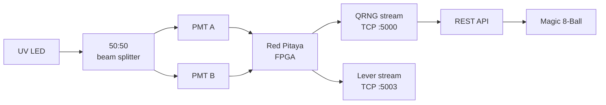
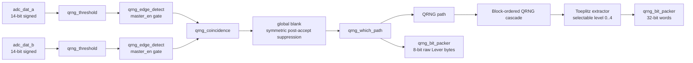
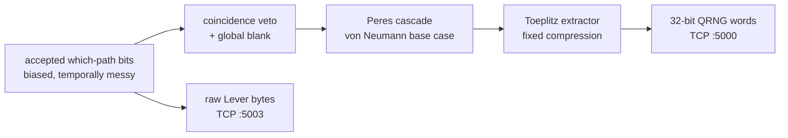
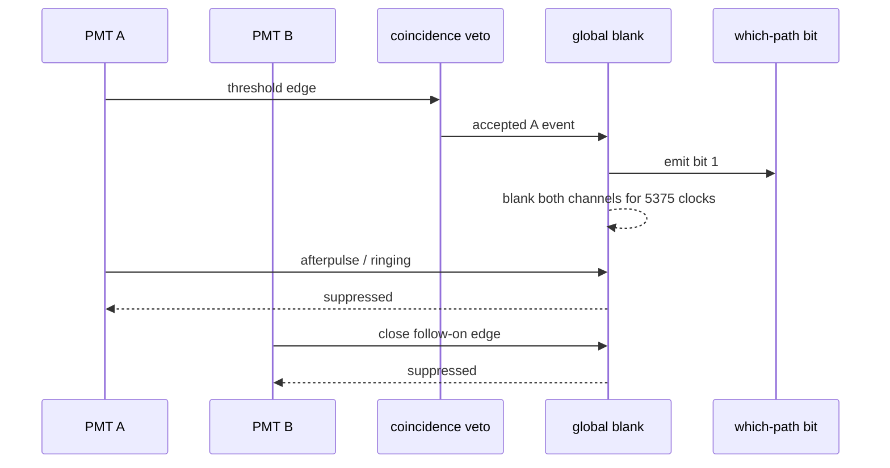
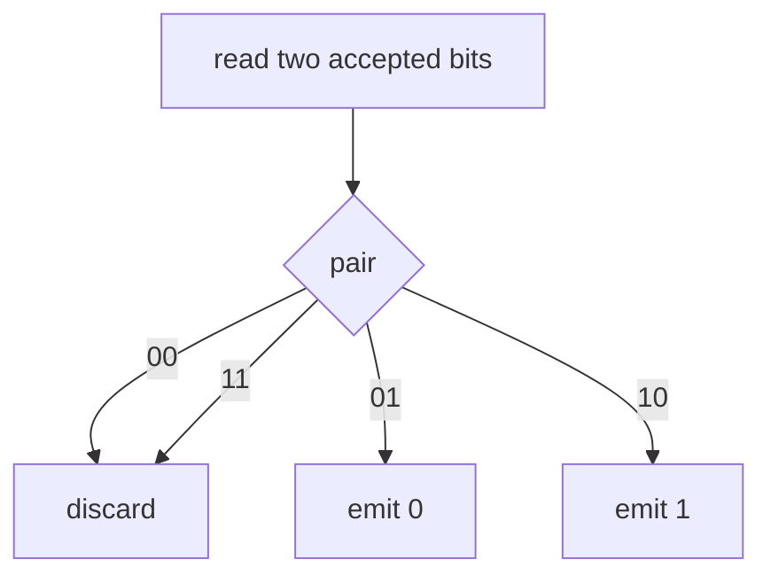
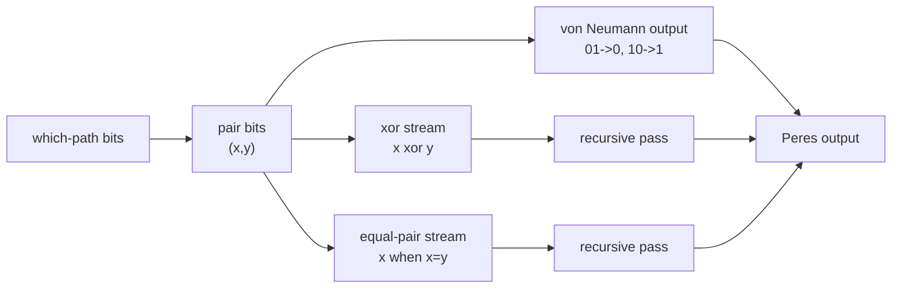
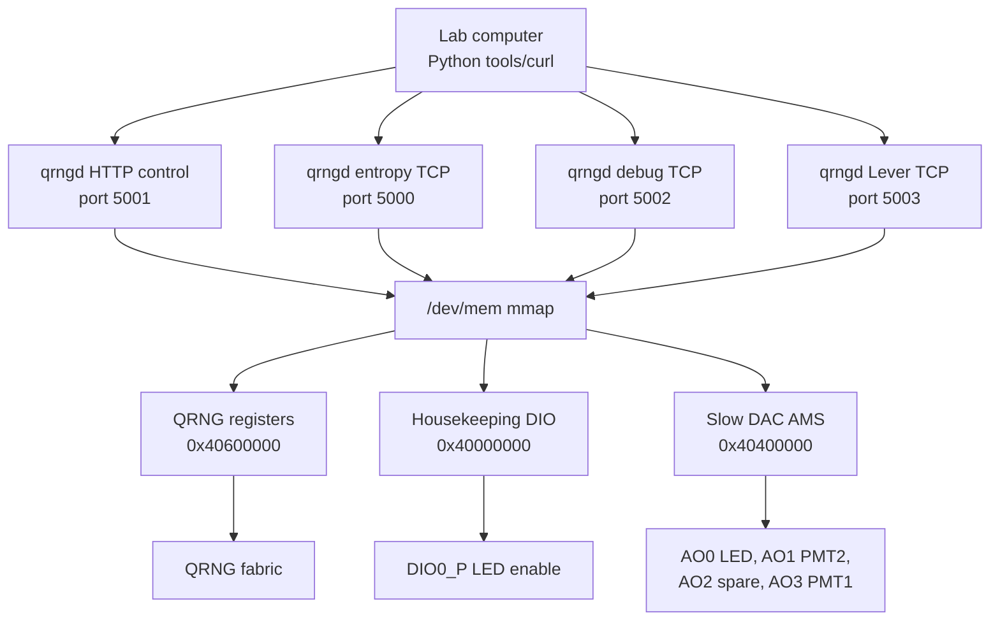

{: width="1920" height="1080" }

Sometimes I get weird projects stuck in my head. I've always wanted to do a "*quantum*" hardware project; in my PhD and postdoc I'd messed about making fluorescent dyes and proteins that were technically quantum (*I designed around a* [*Jablonski diagram*](https://en.wikipedia.org/wiki/Jablonski_diagrams) ), but it was all unsatisfying. I've wanted to get down to single quantum events, ever since reading [*The Fabric of Reality*](https://en.wikipedia.org/wiki/The_Fabric_of_Reality), the 1997 book by physicist David Deutsch.  

This is 'Part One' in a two-part blog series, on my little rabbit hole on this topic. This first part is a build-log on the construction of a Quantum Random Number Generator (QRNG). It's actually a lot more complicated to build one than initially suspected. As usual, my blind ignorance and cheerful initial optimism were the main drivers of the success of this project. One step at a time as you go over the 'over-engineering' cliff...

"*But, wait a sec!*", the thoughtful reader asks. *"Doesn't a normal computer already do this?"* /dev/urandom pulls from an OS entropy pool, ultimately seeded by physical noise sources that are quantum at the bottom... (*waves to NSA* [👋🏻😅](https://en.wikipedia.org/wiki/Dual_EC_DRBG)).

Yes, but only sort of. A *Pseudorandom Number Generator* (PRNG) seeded from OS entropy makes one quantum draw at the seed, then runs deterministically forever after. To be fair to /dev/urandom, it's better than that: modern Linux runs a *Cryptographic RNG* (CRNG) that keeps reseeding itself from interrupt timing, so it's topping up its entropy as it goes. But between top-ups you're still reading the output of a deterministic function, not a fresh physical event. A QRNG generates new physical entropy at *every sampling step*. And although you won't find *any statistical difference* between the three, they have vastly different properties in the most important aspect of all: ***philosophically***.

**Here's what we'll cover:** radioactive lenses from the 70s, Geiger counters, photomultiplier tubes, beam splitters, analog/digital circuitry, von Neumann debiasing, FPGA logic, various server software systems, and the first complete demo: ***a quantum Magic 8-Ball***.

***TL;DR:***

Here is the whole build in one breath:



And a Magic 8-Ball to try: ***ask it your question, and receive exactly one answer here, plus every possible answer across the multiverse.<sup>*</sup>***

<small><sup>*</sup>This offer is exclusive to Everettians; Copenhagenists will receive one answer only, and remain in the boring-interpretation universe.</small>


<!-- markdownlint-disable -->
> **Disclaimer**: Yes, this thing is really connected to my Quantum Random Number Generator, running in my basement in Bavaria. It might go offline occasionally!
{: .prompt-danger }
<!-- markdownlint-restore -->

<a href="#magic-8-ball-target" onclick="event.preventDefault(); history.replaceState(null, '', '#the-quantum-magic-8-ball'); [0, 100, 300, 700, 1200].forEach(function(delay) { setTimeout(function() { document.getElementById('magic-8-ball-target').scrollIntoView(); }, delay); });">
  <span role="img" aria-label="8-ball" style="display:block; width:100%; aspect-ratio:1328 / 1302; background:url('/assets/img/building-the-beam-universe-splitter/8-ball.png') center / contain no-repeat;"></span>
</a>

## Background

This did not emerge fully formed. Well, the idea *kinda* did, but the final architecture is the survivor of several wrong-but-plausible versions:

| Attempt                        | Why it seemed reasonable                        | What killed it                                                           |
| ------------------------------ | ----------------------------------------------- | ------------------------------------------------------------------------ |
| Radioactive lens timing        | Radioactive decay is genuinely random           | a PITA to work with, and I kinda want to be able to use my camera lens   |
| Single PMT photon counter      | Photon arrivals are Poisson                     | Timing bits were valid but not the which-path quantum coin flip I wanted |
| Manual potentiometer tuning    | Great for first pulses on the scope             | Painfully long/boring to sweep reproducibly                              |
| Per-PMT dead time              | Suppress after-pulses on the channel that fired | Creates a private recovery window where the other PMT can win            |
| Von Neumann-only extraction    | Simple, mathematically clean debiasing          | Threw away too many hard-won photons                                     |
| Interleaved cascade serializer | Higher yield than von Neumann                   | Introduced a local lag-4 to lag-8 memory signature                       |
| Plain FIFO readout             | Normal streaming design                         | Returned older data first when interactive requests wanted fresh entropy |


---

## Hardware Build

### The Radioactive Camera Lens Attempt

In my first attempt to harness the quantum realm, I messed about with a gem in my lens collection: an early Canon FD 55mm F1.2 Aspherical lens, with a rear element made with thoriated glass. Hold a Geiger counter to it and it makes you wonder if holding a camera to your eye with this beast mounted is really such a great idea (*but OMG, the **Bokeh**...*).

{: width="1027" height="504" }

But I didn't like it conceptually. Sure, the time between counts is random, but not the cool kind of random I wanted. Timing between the pulses and taking the least significant bit *is random*, but not sexy random. I wanted a proper quantum coin flip.

A Geiger tube gives me *when* something happened. I wanted *which way* something happened. I also had a photon counting PMT, which when wrapped up in aluminium foil, and only counting a few hundred thousand photons per second also worked similarly.  But I wanted a device where the bit was not derived from timing arithmetic, but from a physical choice: *left detector or right detector*. So the spicy camera lens went back on the shelf, and the build moved toward photons, mirrors, and photomultiplier tubes.

---

### The Optical Coin Flip

What was missing was inorganic, raised free-range photons. The final rig uses the canonical setup, using a pair of photomultiplier tubes (PMTs) to measure the 'coin flips':

1. Attenuate a light source until photons arrive one-at-a-time.
2. Point them at a 50:50 beam splitter.
3. Photons 'choose' to go *through* the mirror and hit PMT A; or *bounce off* the mirror and hit PMT B.

Strictly, this is not a heralded single-photon source. It is an attenuated LED/fluorescence source, so arrivals are Poissonian; I am relying on low occupancy, a coincidence veto, and global blanking rather than claiming a measured $g^{(2)}(0)$ single-photon regime. That is still enough for entropy here, because each accepted detection is a beam-splitter which-path event, and the extractor downstream is there to clean up the remaining detector bias and short-range mess.

If PMT A fires, it's a 0. If PMT B fires, it's a 1.  We see which universe we reside in by measuring which path they 'chose'. Simple and elegant.  Except it needs a *lot* of engineering (***but that's why you're here, right?***).

A friend gave me a pair of Hamamatsu photomultiplier tubes (PMTs).  These came from the core of a nano-differential scanning fluorimetry instrument, and were used to analyse protein structure via tryptophan fluorescence, which absorbs light at 280 nm. Like most fluorophores, its emission properties change depending on its chemical environment. When the proteins are all nicely folded up, and the tryptophans are nestled and cosy inside the protein, they're protected from aqueous solution and have a fluorescence emission peak at 330 nm. But when the proteins denature, and their structures scramble, the tryptophan is exposed to water, and the fluorescence is red-shifted to a maximum at 350 nm.

{: width="1600" height="865" }
*The optical pathway, and swapping the dichroic for an ultraviolet 50:50 mirror*

Obviously, I had to take the entire thing apart, poke around, and rip out the dichroic beam splitter. That's the bit that directs light >340 nm down one path and <340 nm down the other, into each of the awaiting PMTs.  The ratio of light measured by the two detectors tells you about how stable the protein is: slowly heat up the protein until it denatures (*cooks...*), as measured ratiometrically as described, and you know how heat-tolerant it is.

I replaced the dichroic beam splitter with a 50:50 half-mirror that works in the UV range. Roughly the same basic hardware, completely different physics. Now the photons would each reach the mirror, and *the detection -- not the photon -- is what forks the world*. We only ever see one of the paths taken, and wonder whether the other path even existed like a damn Copenhagenist...

{: width="912" height="577" }

The optics module expects a protein sample in a quartz glass capillary tube to absorb 280 nm light, and emit ~340 nm light, but I didn't have that stuff handy, and protein samples would break down (*I don't want to grow bacteria in the setup*). So, I tried random stuff like paper and plastics, and it turns out that 3D printed filament is a great material for this project: I can print a lens cover that both blocks ambient light AND is faintly fluorescent at the right wavelength!  The faintness is a bonus, as we are trying to get to the single photon range, and a lit room does between $10^{13}$ and $10^{15}\text{ photons/cm}^2\text{/s}$. But the beam splitter optical setup was just the photogenic part (*get it? lol*). Then came the actual engineering: coincidence rejection, dead-time handling, dark-count filtering, and handling PMT pair biases...

---

### Circuit Overview

From my random gear box, I dusted off an old [Red Pitaya](https://redpitaya.com/), which is more-or-less the 'guts' of an oscilloscope (*fast, high-res ADCs*) together with an FPGA (*field programmable gate array*), and a few ARM cores for good measure.

With the Red Pitaya in Oscilloscope mode, I added in 10 kΩ potentiometers for tuning both the PMTs and LED intensity, via a simple LM334 current regulator IC on a breadboard rig. This let me play around with the system, to test the PMT gain and LED current, and test various materials for fluorescence. ***And actually measure single photon detection events...***

{: width="1920" height="1080" }
{: width="1920" height="1080" }
*After tuning, detecting single photons on either PMT was easy, with a pulse duration of around 20 us, and pulse height determined by the PMT gain*

Those pulses are suuuper *wide* (*tens of microseconds*), where a bare PMT pulse is normally nanoseconds. That is not the photon dawdling; it is the transimpedance amplifier built into these particular Hamamatsu modules, which is leisurely by photon-counting standards. The pair were a freebie pulled from a dead nanoDSF instrument, so I am not going to file a complaint about their bandwidth. Actually, a fat ~20 µs pulse is *convenient* here: it means I can catch single photons comfortably with the Red Pitaya's 125 MHz ADC instead of needing gigahertz front-end electronics. Anyway, that's what I tell myself when I look at the metal cases on the PMTs and start wondering about hacking them open and messing with the transimpedance amplifier circuit...  The cost is rate (*a 20 µs pulse and a ~43 µs global blank put a hard ceiling on events per second*), which is one reason the final output is measured in kilobits, not megabits. 

With the hardware proof-of-concept sorted, it was time to plan out the architecture. The idea was simple:

The FPGA system monitors the BNC-connected PMTs, and registers a bit whenever exactly one detector fires within the coincidence window. It does this by measuring the voltage spikes produced by a transimpedance amplifier (TIA), which converts the PMT anode current across a resistor into a voltage signal.  These are converted to digital values by the ADCs, and the FPGA does the necessary thresholding and timing processing.

My manual circuit control wasn't going to cut it for this project. There are lots of parameters to sweep, and the 10 kΩ pots make this extremely fiddly and boring. ***Why spend 2 hours tuning a circuit by hand, when you can spend 10 hours building an automated tuning system?*** The Red Pitaya has 4 digital-to-analog converters (DACs), and a bunch of digital I/O, as well as 3.3 V and 5 V power sources. Perfect for controlling the system via scripts to manage light intensity and PMT gain programmatically.

{: width="3508" height="2480" }
{: width="2160" height="686" }
*Pro tip: Ask Codex to set pins high or low, and you can focus on getting the probes in the right place while it operates the Red Pitaya GPIOs*

The circuit is split into three main sections: the LED current controller, the reed-relay LED gate, and the relay coil driver. The PMT gain control is handled separately with simple resistor dividers. The power supply is trivial, two Traco Power 5 V DC/DC devices, the TEN 20-2411W1 and the smaller TEN 8-2411W1 at 4 A and 1.6 A respectively. These are isolated, so are stacked together for the necessary -5 V, 0 V and +5 V rails needed for the PMT. These are massively overpowered, but were found in my "*random gear box*", and thus were the correct parts.

#### LED Current Controller

The LED current is set by one channel of an MCP602 op-amp and an NPN transistor used as a low-side current sink. The Red Pitaya slow DAC output, AO0, drives the non-inverting input of the op-amp. The op-amp adjusts the base voltage of Q1 so that the voltage across the sense resistor matches AO0.

The current is therefore approximately:

$$I_{LED} \approx V_{AO0} / R_{sense}$$

With a 6.8 kΩ sense resistor, this gives about 20 uA at 0.136 V and 250 uA at 1.7 V. A 100 kΩ resistor from Q1 base to emitter keeps the transistor safely off during startup or undefined op-amp states. "*Approximately*" is fine too, I don't need linearity here, just sweep and pick good values.

The unused half of the MCP602 is tied off as a unity-gain buffer at ground: the non-inverting input goes to GND, and the output is connected to the inverting input. This prevents the unused op-amp from floating or oscillating.

#### Reed Relay LED Gate

The LED is switched with an HE721C reed relay. The relay contacts are used as an SPDT selector rather than simply breaking the LED path.  Why did I use a relay instead of a MOSFET? Well, firstly, it's what I had in my 'box-of-unsorted-ICs', and secondly, a closed relay isn't a potential source of noise and has no issues at very low currents.

When the relay is off, the current sink is connected directly to +5 V through the NC contact. This keeps the op-amp loop settled, but the LED is disconnected. When the relay is on, the COM contact moves to NO, and the current sink pulls current through the LED. This gives a physical LED disconnect in the default state while avoiding the op-amp railing when the LED is off.  I'm *not 100% sure about this* though.  Analogue electronics is not my strong point, and I'm pretty sure weird stuff happens during the relay switching time; but what you don't measure can't hurt you, right?

The HE721C0500 5 V relay coil is driven by a 2N2222 NPN transistor. A Red Pitaya GPIO pin drives the base through a 1 kΩ resistor, and a 100 kΩ pulldown keeps the relay off while the GPIO is high-impedance or booting. A 1N4148 diode is placed across the coil as a flyback diode.

#### PMT Gain Control

The H10722 PMT modules have a gain-control input, Vcont, with a recommended range of 0.5 V to 1.1 V. Since full gain is not needed, each Red Pitaya slow DAC output is passed through a 10 kΩ / 10 kΩ divider. This maps the 0-1.8 V DAC range to approximately 0-0.9 V at Vcont, keeping the PMTs in a conservative gain range and reducing the chance of clipping the Red Pitaya input (*or frying the PMTs!*).

{: width="1920" height="1080" }
*the assembled Quantum photonic 'coin flip' device*

#### Hardware Control Fun!

The pin-control layer turned out to be more fiddly than expected. The Red Pitaya produces slow DAC voltages, but the experiment sees those voltages after external dividers and analog circuits. The software therefore controls raw 8-bit DAC codes, not "real" physical volts, and you need to carefully calculate the two.

The final pin mapping is:

| Control          | Red Pitaya pin | Meaning             |
| ---------------- | -------------- | ------------------- |
| `led_power_code` | `AO0`          | UV LED power        |
| `pmt2_gain_code` | `AO1`          | PMT B gain          |
| `spare_code`     | `AO2`          | Spare analog output |
| `pmt1_gain_code` | `AO3`          | PMT A gain          |
| `led_enable`     | `DIO0_P`       | Relay / LED enable  |

The DIO pins had their own little trap: on this Red Pitaya image, a direction bit of `1` means output. Treating `0` as output left the pins floating at strange intermediate voltages, which briefly looked like a damaged board. The fix was a slow and boring readback: set one output, measure one pin, write down what actually happened.  Annoying right? '0' looks like **O**utput and '1' like **I**nput, right?

One thing that really helped was keeping the stock Red Pitaya oscilloscope path available in parallel in the FPGA. That was invaluable for watching real photon pulses while the FPGA QRNG fabric was running. There were some timing issues on the oscilloscope IP, but as I didn't write that FPGA code I carefully ignored those errors.

---

## Tuning The Detectors

With everything set up, it was time to tune the device. That involved first finding the threshold for a photon detection, then tuning the gain on each PMT, and finally finding a good LED intensity that maximised the number of 'coin flips' per second, without causing too many collisions (*two photons arriving at nearly the same time to one or both PMTs*).

Mechanically, tuning the photon detection rate was done with highly technical approach of ***covering some of the optical path with sticky tape***. UV seems to get blocked a bit. With 3 guesses on tape placement, I had the PMTs balanced to below 5% difference, and decided to call it a day, (*because taking the damn thing apart and reassembling it over and over is both boring and a guaranteed way to break something eventually*).

{: width="814" height="714" }

How do we actually detect the photons *really really fast?* We code all the processing stuff in VHDL ([*VHSIC Hardware Description Language*](https://en.wikipedia.org/wiki/VHDL)). This 'code' is a description of the circuit we build in the field programmable gate array (**FPGA**). For example, this is the edge detector that finds photons from the ADC voltage pulses:

```vhdl
-- Edge detector: emits a one-cycle pulse on the rising edge of over_thresh.
-- Output registered; one cycle of latency from over_thresh transition.
--
-- This is also the master-enable gate. When enable='0' the output is held
-- low regardless of input, which prevents the reset-state flood (threshold=0,
-- polarity=1 fires on every negative noise sample) from reaching downstream
-- coincidence/global-blank logic before software has configured the
-- discriminator.
--
-- The internal delay register over_thresh_d1 tracks over_thresh continuously,
-- including while enable='0', so re-enabling does not produce a spurious
-- pulse if over_thresh has been high the entire time.

library ieee;
use ieee.std_logic_1164.all;
use ieee.numeric_std.all;
use work.qrng_pkg.all;

entity qrng_edge_detect is
    port (
        clk         : in  std_logic;
        rstn        : in  std_logic;
        enable      : in  std_logic;

        over_thresh : in  std_logic;
        edge_pulse  : out std_logic
    );
end entity qrng_edge_detect;

architecture rtl of qrng_edge_detect is
    signal over_thresh_d1 : std_logic;
begin
    process(clk)
    begin
        if rising_edge(clk) then
            if rstn = '0' then
                over_thresh_d1 <= '0';
                edge_pulse     <= '0';
            else
                over_thresh_d1 <= over_thresh;
                edge_pulse     <= enable and over_thresh and not over_thresh_d1;
            end if;
        end if;
    end process;
end architecture rtl;
```

The top half of that code is the outside of the chip. `entity qrng_edge_detect is` names the little block, and the `port` list is the set of pins sticking out of it: clock, reset, enable, comparator input, and pulse output. *Think of it as the names on the little legs on an IC.*

The bottom half is the mysterious stuff inside the black epoxy case. `architecture rtl of qrng_edge_detect is` describes the actual circuit: one register remembers the previous comparator state, and the output goes high for exactly one clock when the comparator level rises while the master gate is enabled.

{: width="1200" height="840" }
*The same `qrng_edge_detect.vhd` idea drawn as a tiny integrated circuit: pins on the outside, one remembered comparator state on the inside, and a one-clock pulse when a photon edge arrives.*

That is the basic FPGA game. You create a bunch of these little virtual ICs, called **IP blocks** for some arcane reason, and then wire them together. One block thresholds the ADC sample. One block turns a threshold level into a one-clock edge. One block checks coincidences. One block applies the global blank. One block packs the surviving bits. The final "program" is less like Python and more like drawing a circuit schematic with text, where ***everything is happening at the same time!***

Setting the gain is straightforward: With a reasonably high gain and light intensity, we can do a ROC curve based on peak-signal-cutoff, and count photons on each PMT. Due to the optical path and mirror reflectance etc etc, we will have a different count for each PMT. Then, we just keep lowering the gain, and doing the ROC analysis, until our photon count dips. We back up a bit, and we have our gain.

That ROC sketch is the intuition; the tool I actually used to choose a gain is the *edge-count survival ratio*. For each PMT gain I captured raw ADC waveforms twice — LED off (dark and noise only) and LED on (dark plus photons) — then swept every plausible discriminator threshold offline and counted rising threshold crossings in each:

> edge survival ratio = light_edges(threshold) / max(dark_edges(threshold), 1)


The `max(..., 1)` just avoids dividing by zero once the dark edges vanish. I count *edges*, not above-threshold samples, on purpose: a fat photon pulse contributes many above-threshold samples but only one rising edge, and one edge per pulse is exactly what the FPGA discriminator sees.

The ratio reads like a map of the safe operating window. Low means the threshold is still buried in noise. A sharp rise means dark edges are falling away while photon edges survive. A *wide* high plateau is a gain that tolerates threshold drift; a narrow one is a knife-edge that betrays me the moment the baseline wanders. A fall-off at high threshold means the discriminator is starting to miss real photons.

{: width="1600" height="1032" }
*Edge survival ratio (LED-on edges divided by dark edges) versus threshold depth above baseline, swept across PMT gain codes 170-230. Higher gain (red) holds the ratio high across a much wider threshold range; low gain (blue) collapses early. The zoomed lower panels show the safe band opening up as gain rises.*

The picture is pretty clear: higher PMT gain pushes the photon edges further from the dark/noise tail, widening the safe threshold band. I settled on **gain=212** — a broad, drift-tolerant threshold window without pushing the tubes unnecessarily hard.  With the gain set, it's pretty easy to set the pulse cut-off. With the LED off, we see noise around some mean. We measure a while and get the noise range. Then, we turn on the LED and pick a threshold a safe distance away.

{: width="2210" height="918" }
*Finding the threshold for each PMT. We look for the point at which we are no longer sampling the PMT noise. This was done at high gain, 240, or ~0.85 V.*

Finally, we can find the optimal LED brightness. As you can see in the graph below, it start low (*duh*), gets higher, *and then goes down again*.  This is because we are 1) carefully throwing out any events where *both PMTs fire at the same time*, as this might be a cosmic ray or electrical interference, and not photons, and 2) we take breather after detecting a photon (*more details on that later*). That basically means that at low brightness we can measure most photons but as we increase the brightness, eventually we have more and more cases where we get simultaneous photons and have more recovery pauses for no extra valid 'hits'.


{: width="1333" height="1600" }
*Refined LED-power scan at gain 212 (thresholds A=-15, B=+6). QRNG output peaks near LED power code 108, where the accepted-event rate is high, the A/B imbalance stays around 1% (*far below the 5% line, but it drifts around a few percent*), and both ADC maxima sit well under the clipping guard. The operating point is chosen just before the high-power rate drop-off.*

The tuning process eventually became a little experimental pipeline of its own:

1. Turn the LED off.
2. Sweep PMT gain upward in 16-code steps.
3. Measure dark counts, baseline, standard deviation, ADC extrema, and over-threshold occupancy.
4. For each gain, sweep threshold and find where LED-off counts fall to the dark-count floor.
5. Turn the LED on and measure photon-driven accepted rate at those thresholds.
6. Lower gain until the photon count starts to collapse, then back up.
7. Sweep LED power and choose a point before the rate drop-off or clipping margin gets uncomfortable.

The final operating point is deliberately conservative:

| Setting            |                   Value |
| ------------------ | ----------------------: |
| LED power          |                   `108` |
| PMT A gain         |                   `212` |
| PMT B gain         |                   `212` |
| Threshold A        |         `-15` ADC codes |
| Threshold B        |          `+6` ADC codes |
| Coincidence window |   `125` clocks = `1 us` |
| Global blank       | `5375` clocks = `43 us` |

We also need to watch the PMTs carefully. When a photon hits a PMT, there can be after-pulses, recovery tails, or threshold re-crossings. We really do not want to count a photon and its tail as four photons in a row. The tempting fix is per-channel dead time: ignore PMT A after PMT A fires, and ignore PMT B after PMT B fires, as each PMT has its own recovery behavior, so blank each PMT after it fires.  That fix is subtly wrong for a two-detector QRNG. If A fires and only A is dead, then B gets a private window where only B can win. That creates artificial alternation. The corrected logic uses a symmetric global blank: after any accepted event, both channels are ignored for the same interval.

{: width="1600" height="960" }
*With global blank disabled, the conditional next-event probabilities split hard at short inter-arrival times: P(A&#124;A) and P(B&#124;B) climb toward 0.9 while the cross terms collapse, then converge to the ideal 0.5 as the gap grows. That short-lag split is detector recovery logic, not the beam splitter. The chosen 43 µs blank (dotted line) sits well inside the converged region.*

{: width="1600" height="800" }
*The global blank decision scan. Sweeping the blank offline, both the RMS and the max channel-memory difference collapse as the blank grows, flattening into the noise floor after a few tens of microseconds. GB=4000 clocks (~32 us) already cleared the obvious structure during development; the finer sweep settled on GB=5375 (~43 us, dashed line) as marginally cleaner, and that is the operating value.*

This is where the timestamped debug stream saved the day. The FPGA can emit 64-bit debug records containing an ADC-clock timestamp, event type, channel, and flags:

> Given that A just fired, what is the probability that the next accepted event is A, as a function of the time gap?

Then ask the same question after B. If the two curves separate at short lags, the detector logic is writing memory into the event stream.

The useful conditional probabilities were:

```text
P(next = A | previous = A)
P(next = B | previous = A)
P(next = A | previous = B)
P(next = B | previous = B)
```

With no global blank, the short-lag structure looked exactly like detector recovery logic. Same-channel events were suppressed for a while, opposite-channel events had an artificial advantage, and the stream had a 'local memory' due to PMT dynamics. Scanning the global blank setting showed the pattern collapsing as the blank got longer. Around `4000` ADC clocks, or `32 us`, the short-range artifact was already gone enough that the remaining imbalance was the boring optical one: one PMT path was slightly hotter than the other. A later, finer pass pushed the operating blank a little further still, to `5375` clocks (`43 us`), which measured marginally cleaner again — that is the value the shipped system uses.

The graph does not line up exactly at 0.5 because the two optical paths and PMTs are not identical. That is a bias issue, not the same thing as a timing-memory issue. Bias can be handled mechanically and by extraction. Timing memory has to be removed before extraction, or the extractor is being asked to clean up detector behaviour rather than photon 'choices'.

---

## FPGA Fabric

The pipeline runs on the Pitaya `adc_clk` (125 MHz). Both ADC channels feed parallel discriminator paths that converge at the coincidence stage. Surviving events pass through a symmetric global blank, become which-path bits, and then fork into a QRNG stream and a raw Lever stream.



Each channel has a signed 14-bit ADC threshold and a runtime polarity bit. Because the photon pulses are positive ADC excursions above baseline, the operating profile selects positive-going detection (`polarity = 0`):

```text
over_thresh = adc_sample > threshold
```

The threshold output is a level. `qrng_edge_detect` turns the rising edge of that level into a one-cycle pulse. If a PMT pulse rings or crosses threshold again on the tail, coincidence plus the symmetric global blank suppress close follow-on events without creating per-channel recovery asymmetry.

Two active filters protect the event stream:

| Filter           | Scope         | What it removes                                                                                  |
| ---------------- | ------------- | ------------------------------------------------------------------------------------------------ |
| Coincidence veto | Cross channel | Events where both detectors fire within the coincidence window                                   |
| Global blank     | Both channels | Pulse-tail/retrigger events and short-range detector/electronics memory after any accepted event |

The Coincidence Veto should block weird events such as Cosmic Rays, which while cool AF, are not the aim of this project and need to be rejected.

The global blank is symmetric: any accepted event suppresses both channels for the same interval. This prevents channel-dependent recovery windows from creating artificial alternation or recovery-dependent correlations, as discussed above. The GB=5375 setting suppresses immediate same-channel pulse-tail/retrigger bursts seen in debug captures.

After coincidence and global blanking, each accepted event becomes a which-path bit. From that point the fabric forks into two separate consumers:

- The QRNG path runs the block-ordered QRNG cascade, applies selectable Toeplitz compression, and produces the 32-bit words served on TCP port `5000`.
- The Lever path packs raw which-path bytes and serves them on TCP port `5003`, *much more on this in Part 2 of this series*
- Both paths also expose a non-consuming latest-value tap in the register map: `LATEST_QRNG_WORD` and `LATEST_LEVER_BYTE`. These taps update in parallel with ring writes and are useful for LED displays, mmap probes, and sampled checks that must not drain either output ring.

The only runtime selector for the QRNG stream is the fixed Toeplitz compression level. Raw data is available only from the Lever path, which keeps the main QRNG interface simple.

The output buffers are intentionally not ordinary chronological FIFOs. For the way this machine is used, freshness is valuable: if a user asks for one QRNG word, *it is nicer to return the newest retained word* than one that has been waiting in a queue for seconds. The fabric therefore uses newest-first ring buffers:

| Stream |        Unit |         Depth | Approximate stored span |
| ------ | ----------: | ------------: | ----------------------: |
| QRNG   | 32-bit word |  `2048` words |            about `16 s` |
| Lever  |  8-bit byte | `16384` bytes |            about `16 s` |

Reads pop the newest retained item. If software asks faster than the apparatus produces fresh data, the ring still has older retained data to absorb the burst. If nobody asks for a while, old items are overwritten first. This slightly weird twist on a circular buffer is exactly the trade I want for an interactive quantum toy and a lab instrument: fresh when possible, buffered when necessary.

The non-consuming latest taps are a separate convenience. They let me sample the most recent QRNG word or Lever byte data for health monitoring without draining the real output rings. Polling them can skip values or repeat the previous value, so serious captures use the TCP streams. For a status display, skipping words is fine; it does not reduce entropy, it only means the display did not look at every produced word.

### Hardware Debuggers are Awesome!

The debug fabric was an expensive use of FPGA fabric; a 2048-deep, 64-bit timestamped event FIFO is not free on a small Zynq-7010. At various points I was worried about tearing fabric space and timing (*I'm sure there's a good pun here...*), and the debug block was one of the larger custom pieces that was not directly producing entropy.

It saved the day many times:

| Diagnostic            | Counter-only view               | Timestamped-event view                                       |
| --------------------- | ------------------------------- | ------------------------------------------------------------ |
| Afterpulsing          | "Counts are high"               | "Same-channel events cluster at this delay"                  |
| Per-channel dead time | "Rates changed"                 | "Opposite-channel next-events are favoured during the blank" |
| Coincidence veto      | "Veto count increased"          | "Vetoes are concentrated near zero lag"                      |
| Global blank tuning   | "Rate drops as blank increases" | "Short-lag memory disappears around this blank length"       |

The design rule was that debug must never back-pressure entropy. If the debug FIFO overflows, it drops debug records and sets a sticky flag. It does not stall the QRNG path. That was important philosophically and practically: the diagnostic tool is allowed to lose observations, but it is not allowed to perturb the thing being observed.

To make room for the final QRNG image, unused stock Red Pitaya fabric was trimmed. The stock fast-DAC ASG, PID, and Daisy-chain blocks were stubbed out because this project does not use the fast DACs. The slow analog outputs and DIO remain available through the Red Pitaya AMS and housekeeping registers. That kept the oscilloscope input path useful while giving the custom QRNG fabric enough breathing room.

<details markdown="1">
<summary><strong>Optional detail: timing and extraction levels</strong></summary>

Latency from a threshold crossing to a post-coincidence which-path bit is about `260` fabric cycles, or `2.08 us`, plus QRNG path and packer latency. The latency does not matter for entropy quality. The important timing parameters are coincidence window, global blank, and readout overflow behavior.

Toeplitz levels:

| Level | Output per 1024 input bits | Fraction kept |                             Measured rate |
| ----: | -------------------------: | ------------: | ----------------------------------------: |
|   `0` |                     `1024` |         `8/8` | Toeplitz bypass, post-cascade diagnostics |
|   `1` |                      `512` |         `4/8` |                         Very conservative |
|   `2` |                      `640` |         `5/8` |                              Conservative |
|   `3` |                      `768` |         `6/8` |       Conservative baseline (development) |
|   `4` |                      `896` |         `7/8` |                         Operating default |

The `3200 bit/s` target for `100` 32-bit tokens/s remains aspirational at the present conservative optical setting. We do not raise the output rate by emitting insufficiently conditioned bits.

The build is not tiny, but it fits comfortably enough after removing unused stock fast-DAC ASG, PID, and Daisy-chain fabric. The stock oscilloscope input path and slow control blocks remain.

| Resource        |    Used | Available | Utilization |
| --------------- | ------: | --------: | ----------: |
| Slice LUTs      |  `8481` |   `17600` |    `48.19%` |
| Slice registers | `11754` |   `35200` |    `33.39%` |
| Slices          |  `3612` |    `4400` |    `82.09%` |
| Block RAM tiles |    `26` |      `60` |    `43.33%` |
| DSP48E1         |     `6` |      `80` |     `7.50%` |

Vivado reports positive timing margin for the QRNG/newest-ring/Toeplitz image: whole-design WNS is about `+0.072 ns`, with no setup or hold violations. Slices are the tightest resource; BRAM and DSP are still comfortable.

</details>

---

## Debiasing the Quantum Data

The raw "which-path did the photon take" stream is not a finished QRNG.

It is a beautiful physical signal, but it is still a physical signal. PMT A and PMT B do not have identical gain. The beam splitter is not exactly 50:50. The optical path is not perfectly symmetric. The thresholds drift. The PMTs afterpulse. Cables and amplifiers have the *wrong kind of noise*. If I pipe that straight into a randomness test, I am mostly testing how shitty the hardware setup is.

The QRNG path therefore has three different conditioning layers, because they solve three different problems:



The bottom branch is important: the raw Lever stream is deliberately **not** debiased, Peres-processed, or Toeplitz-compressed. *The Lever stream exists for the philosophical stunt in the next post*. This post's Magic 8-Ball and ordinary QRNG output use the conditioned QRNG path.

### Layer 1: Blanking Removes Memory

The first layer is not a randomness extractor. It is detector hygiene.

When a PMT fires, it can ring, recover slowly, or produce afterpulses. If I count those as new photons, I am no longer measuring independent path choices. I am measuring the recovery behavior of the detector. The global blank fixes that by suppressing both channels for the same interval after any accepted event.



This is why the blank is symmetric. If I blank only the channel that fired, I create a new bias: after A fires, B gets a private window where only B can win. That would make the stream look nicely alternating and absolutely fake. The point of the global blank is to remove local detector memory without creating channel-dependent recovery rules.

Blanking does not make the ones and zeroes balanced. It makes the bits closer to independent, which is the precondition the next layers need.

### Layer 2: First Attempt - von Neumann Debiasing

{: width="1119" height="1405" }

The simplest way to fix detector imbalance is [von Neumann debiasing](https://mcnp-green.lanl.gov/pdf_files/InBook_Computing_1961_Neumann_JohnVonNeumannCollectedWorks_VariousTechniquesUsedinConnectionwithRandomDigits.pdf).

Take the raw stream in pairs:

```text
00 -> discard
11 -> discard
01 -> 0
10 -> 1
```

If the bits are independent, this removes bias even when PMT A and PMT B are not balanced. The reason is simple: `01` and `10` have the same probability.

$$P(01)=p(1-p)$$

$$P(10)=(1-p)p$$

So they match, no matter what $p$ is.



I originally did this, because it is the obvious first correct answer. It is also wasteful of my precious photons (***note to self: add Gollum meme***).  With an unbiased source, half the pairs are `00` or `11`, so a two-bit input pair produces an output bit only half the time. That means the best-case output is about one output bit for every four input bits. If the detectors drift away from 50:50, it gets worse.

The data made that tradeoff concrete: In one 60 second run, the von Neumann-only path processed about 3203 input pairs per second and produced about 1599 output bits per second.

### Layer 2: V2 - Peres Recovers The Wasted Bits

Peres debiasing keeps the nice property of von Neumann debiasing, but recursively recovers entropy from the pairs von Neumann throws away.

The intuition is that the discarded pairs still contain information. If a pair was equal, the first bit of that pair is still a biased sample. If a pair was unequal, the fact that it was unequal is also structured information. Peres takes those leftover streams and feeds them back through the same debiasing logic.

The hardware version is a block-ordered cascade. It evaluates accepted which-path bits in pairs, keeps useful pair outputs, and then evaluates two residual streams. The stage outputs are drained as contiguous blocks (`stage1`, then `xor`, then `equal`) rather than interleaved bit-by-bit. This preserves local ordering within each layer and avoids serializer-induced short-lag memory.



The final cascade recovered much more of the discarded structure. In a short cascade run, the output rate was about `4405 bit/s` from about `5181` evaluated pairs per second, an efficiency of roughly `0.85` output bits per evaluated pair. That number is not the final QRNG rate because the Toeplitz stage later compresses the stream for margin, but it explains why the von Neumann-only design was removed.

### Layer 3: Toeplitz Extraction Compresses The Residue

Peres removes bias under its assumptions, but real hardware is annoying. The residual stream can still have tiny correlations, imperfect independence, or long-range structure that did not show up in the first-order bit balance.

That is what Toeplitz extraction is for.

A Toeplitz extractor takes a block of input bits and multiplies it by a fixed binary Toeplitz matrix. In this design, each 1024-bit post-cascade block is compressed to one of several selectable output sizes:

| Level | Output per 1024 input bits | Fraction kept | Use                                       |
| ----: | -------------------------: | ------------: | ----------------------------------------- |
|   `0` |                     `1024` |         `8/8` | Toeplitz bypass, post-cascade diagnostics |
|   `1` |                      `512` |         `4/8` | Very conservative                         |
|   `2` |                      `640` |         `5/8` | Conservative                              |
|   `3` |                      `768` |         `6/8` | Conservative baseline (development)       |
|   `4` |                      `896` |         `7/8` | Operating default                         |

At level 4 — the operating setting — I keep 896 bits out of each 1024-bit post-cascade block. That is a 12.5% compression tax paid to turn "looks pretty good" into "has a stated entropy margin". The more conservative level 3 (768 bits, a 25% tax) was the development default; the statistical campaign later in this post is what justified relaxing to level 4.


Visually, the operation is just XOR fan-in:

```text
output bit 0 = parity(selected input bits from Toeplitz row 0)
output bit 1 = parity(selected input bits from Toeplitz row 1)
output bit 2 = parity(selected input bits from Toeplitz row 2)
...
```

The matrix is fixed, deterministic, and public. It is not a secret key and it is not cryptography in the usual "hide information from an attacker" sense. It is a randomness extractor: if the input block has enough min-entropy, compression leaves an output block that is much closer to uniform.

The seed that defines the Toeplitz matrix is compiled into the FPGA bitstream. My first build used Python's `secrets` library on my PC, because the QRNG did not exist yet. Once the hardware and block-ordered cascade were fixed, ***I bootstrapped a replacement seed from the QRNG itself.***. Pretty cool, right?

That seed-generation run deliberately bypassed the Toeplitz matrix (`toeplitz_level = 0`), so the source was the post-cascade stream rather than output from the old seed. I captured 8192 post-cascade bits, sanity-checked the short sequence for obvious weirdness, took the first 1919 chronological bits, and committed those directly as the public Toeplitz seed. The 1919-bit seed itself had monobit `p = 0.451`, runs `p = 0.935`, and byte chi-square `p = 0.877`. Tiny tests on tiny sequences do not prove much, but they are good at catching dumb mistakes.

Either way, the seed is not runtime state. It is public, deterministic, and part of the bitstream. Here it is in all its glory:

{: width="528" height="528" }
*The current 1919-bit public Toeplitz seed, visualized as a 44x44 square. Black pixels are `1`, white pixels are `0`, and the pale padded pixels at the end are not part of the seed. The slightly odd 1919-bit length is not arbitrary: it is `1024 + 896 - 1`, enough to define the largest 1024-input, 896-output Toeplitz matrix used by level 4.*

### Why All Three Layers?

This was *a lot of engineering*, but necessary, because none of them replaces the others.

| Layer    | Problem it solves                                                                                | Why the next layer still exists                                                        |
| -------- | ------------------------------------------------------------------------------------------------ | -------------------------------------------------------------------------------------- |
| Blanking | PMT afterpulses, ringing, coincidence, short-range detector memory                               | It does not balance A/B probabilities                                                  |
| Peres    | First-order path bias from unequal PMTs and optics, without von Neumann's brutal throughput loss | It assumes the stream is close to independent and does not give a final entropy margin |
| Toeplitz | Residual bias/correlation and min-entropy compression                                            | It should not be asked to clean up obvious detector pathology                          |


So the QRNG path is deliberately boring and layered:

> physical cleanup -> efficient debiasing -> conservative extraction

However, the Lever path is deliberately messy:

> physical cleanup -> raw which-path bytes

That split gives me two cool thing: Port `5000` is for really random numbers. Port `5003` is for making the next blog article philosophically questionable.

---

## How "Quantum" is the bit, really?

This section exists because fun discussion with [bregav on r/FPGA](https://www.reddit.com/r/FPGA/comments/1uffhl6/comment/otz3jvg/). The extractor removes bias, but that just raises the real question: of the entropy that survives, *how much is genuine Born collapse* vs thermal junk that *looks* random? bregav proposed pinning that down with the [**purity**](https://en.wikipedia.org/wiki/Purity_(quantum_mechanics)) of the source state.  Worth working through, because the corrected version is computable from things I already measured.

Purity is:

$$ \mathrm{Tr}(\rho^2) = \int S(\omega)^2\, d\omega $$

the inverse participation ratio of the normalized spectrum: basically $1/N_\text{eff}$, the number of thermal modes I'm populating. Basically it's a measure of how alike my photons are. High purity means they're near-clones — same colour, same mode, one tight monochromatic formation of troops. Low purity means they are smeared across many wavelengths and angles, a mob of unruly photons. The later is what my LED broadband LED delivers, and why bregav brought up the topic.

The problem I think is that purity is a property of the ***input state alone***. The thermal contamination of the *output bit* depends on input $\times$ coupling, so on exactly how mode-dependent the beam splitter is. The splitter response $R(\lambda,\theta)$ never appears anywhere in $\mathrm{Tr}(\rho^2)$, so purity structurally cannot be the quantum fraction of the bit, right?

Let's take this to the extreme, for illustration. Take a *maximally impure source* (purity ($\to 1/N_\text{eff}$)), and run it through a *perfectly* mode-independent 50/50 splitter. Every mode now gives ($P(A \mid m) = \tfrac{1}{2}$) exactly, so knowing the mode tells you nothing about the bit —> the output is pure Born collapse *despite* a source that's as thermal as it gets. Purity is "maximally contaminated"; the bit is "perfectly quantum"; and the bit is the thing you sample. Contamination isn't set by how mixed the input is, it's set by how much the splitter distinguishes the mixture.

A perfectly flat splitter is of course an idealization; real dielectric coatings ripple across $\lambda$ and $\theta$, which is the entire point of what follows.


### The right object

Decompose the output bit $X$ against the thermal mode $M$:

$$ H(X) = \underbrace{H(X \mid M)}_{\text{Born}} + \underbrace{I(X;M)}_{\text{thermal}} $$

$H(X \mid M)$ is what's left when an observer knows *exactly* which mode each photon was in, that's the irreducibly quantum part. $I(X;M)$ is the mutual information between mode and bit: precisely the thermal leakage an adversary who knew the mode could exploit. That mutual information is the "*how much is thermal*" number.

The quantity I actually want is the mode-averaged Born entropy:

$$ H(X \mid M) = \int p(m)\, H_2\!\big(P(A \mid m)\big)\, dm, $$

which is the average of the per-mode entropy (*not* the per-mode bias), and I can compute it from the same spectrum I'd use for purity, weighted by the coating's $R(\lambda,\theta)$.

We write each per-mode probability as $P(A \mid m) = \tfrac{1}{2} + \varepsilon_m$ and expand.[^expansion] To second order,

$$ H(X \mid M) \approx 1 - \tfrac{2}{\ln 2}\,\langle \varepsilon_m^2 \rangle. $$

The *marginal* bit only ever sees the mean bias, $H(X) \approx 1 - \tfrac{2}{\ln 2}\,\mu_\varepsilon^2$, so the leakage is

$$ I(X;M) \approx \tfrac{2}{\ln 2}\,\sigma_\varepsilon^2. $$

The thermal leakage is the **variance** of the splitter bias across populated modes, not the mean. The mean bias is exactly what von Neumann debiasing and the Toeplitz extractor already strip out; *the variance is the irreducibly mode-correlated part that survives them*.

### The Quantum Spec for this Device

Let's figure out a ballpark estimate for my build: The bias varies only a few percent across the LED's spectral and angular spread, so $P(A \mid m) \in {\sim}[0.47, 0.53]$. Taking the edge of that band as a conservative floor, $H_2(0.53) \approx 0.997$ bits, although the population-averaged $H(X \mid M)$ is *higher* than this, since the worst mode is rare, so treat $0.997$ as a floor rather than the mean. The leakage is $I(X;M) \approx \tfrac{2}{\ln 2}\sigma_\varepsilon^2 \approx 10^{-3}$ bits.

One important refinement before anyone feeds these to an extractor: *$0.997$ is a Shannon number, and the extractor doesn't run on Shannon entropy*, ***it runs on min-entropy.*** Against the same adversary-knows-$M$ that justified $I(X;M)$ in the first place, the guessing probability is $p_\text{guess} = \tfrac{1}{2} + \langle\lvert \varepsilon_m \rvert\rangle$, so the conditional min-entropy is:

$$ H_\infty(X \mid M) = -\log_2\!\big(\tfrac{1}{2} + \langle\lvert \varepsilon_m \rvert\rangle\big) \approx 1 - \tfrac{2}{\ln 2}\,\langle\lvert \varepsilon_m \rvert\rangle. $$

That's **linear** in the bias, not quadratic. At the worst mode $-\log_2 0.53 \approx 0.916$ bits; averaged across the band it sits around $0.95$. So the extractor has to compress a few percent harder than the Shannon figure implies. 

That basicallay gives us the specs for this DIY QRNG:

- **Shannon quantum content** $H(X \mid M) \gtrsim 0.997$ bits — how much of the bit is collapse vs thermal. 
- **Min-entropy** $H_\infty(X \mid M) \approx 0.95$ bits (floor $\approx 0.92$ at the worst mode) — the seed budget the Toeplitz extractor actually has to work with.
- **Uniformity** $\approx 0.999$ — the marginal bias after debiasing. 

[^expansion]: $H_2(p)$ in bits has second derivative $-4/\ln 2$ at $p = \tfrac{1}{2}$, giving $H_2(\tfrac{1}{2} + \varepsilon) = 1 - \tfrac{2}{\ln 2}\varepsilon^2 + O(\varepsilon^4)$. For the min-entropy line, the average guessing probability is $p_\text{guess} = \sum_m p(m)\,\max\big(P(A \mid m),\, 1 - P(A \mid m)\big) = \tfrac{1}{2} + \langle\lvert \varepsilon_m \rvert\rangle$, so $H_\infty = -\log_2(\tfrac{1}{2} + \langle\lvert \varepsilon_m \rvert\rangle) = 1 - \log_2(1 + 2\langle\lvert \varepsilon_m \rvert\rangle) \approx 1 - \tfrac{2}{\ln 2}\langle\lvert \varepsilon_m \rvert\rangle$.

---

## Board Software

The QRNG fabric is memory mapped at `0x40600000`. `qrngd` runs on the Red Pitaya ARM core and owns normal access to this register block.

One of the earliest readout mistakes was trying to drain entropy through the generic Red Pitaya `monitor` utility one word at a time over SSH. Not 'cool', and really slow. The fix was to move the hot path onto the board: `qrngd` written in C++ uses `mmap` on the ARM core, drains the register block directly, and serves simple TCP streams to the outside world.



HTTP mutation endpoints are POST-only to avoid accidental browser/shell repeats. This is a trusted-network lab API, not an authenticated service, and I don't expect my kids to hack it (*and would be proud if they did*).

Important endpoints:

| Endpoint                             | Method | Purpose                                        |
| ------------------------------------ | ------ | ---------------------------------------------- |
| `/health`                            | GET    | Snapshot counters, ADC diagnostics, FIFO state |
| `/controls`                          | GET    | Read slow DAC/DIO requested state and readback |
| `/controls?...`                      | POST   | Set LED power, PMT gain, LED enable            |
| `/configure?...`                     | POST   | Set thresholds and timing                      |
| `/profile`                           | GET    | Read active profile                            |
| `/profile/save?led_enable_default=1` | POST   | Persist defaults to `/root/qrng_profile.json`  |
| `/profile/load`                      | POST   | Reload persisted profile                       |
| `/debug/events/status`               | GET    | Debug FIFO state                               |
| `/debug/events/configure?...`        | POST   | Enable/mask debug event capture                |

The board exposes four services:

| Service          | Endpoint                                                                  | Purpose                                        |
| ---------------- | ------------------------------------------------------------------------- | ---------------------------------------------- |
| Entropy TCP      | `tcp://<host>:5000`                                                       | Little-endian 32-bit QRNG words                |
| Debug HTTP       | `http://<host>:5001/health`                                               | Counters and ADC diagnostics                   |
| Debug events TCP | `tcp://<host>:5002`                                                       | Little-endian 64-bit timestamped event records |
| Lever TCP        | `tcp://<host>:5003`                                                       | Raw newest-first which-path bytes              |
| Control HTTP     | `GET http://<host>:5001/controls`, `POST http://<host>:5001/controls?...` | Slow DAC codes and LED enable                  |

The Red Pitaya boots into the QRNG image with a small `systemd` service: load `/root/qrng_red_pitaya.bit.bin` with FPGA manager, compile/use the native `qrngd` binary, load `/root/qrng_profile.json`, and start the TCP/HTTP services.

Loading the FPGA still resets the slow DAC and DIO state, so the daemon treats profile load as part of bring-up. The profile is explicit about whether the LED should come back enabled. That is a small safety detail, but small safety details are the whole game when software controls light and PMT gain.

<details markdown="1">
<summary><strong>Optional detail: tuned operating profile</strong></summary>

| Setting                 |                                                    Value |
| ----------------------- | -------------------------------------------------------: |
| LED power               |                          `led_power_code = 108` on `AO0` |
| PMT1 gain               |                          `pmt1_gain_code = 212` on `AO3` |
| PMT2 gain               |                          `pmt2_gain_code = 212` on `AO1` |
| LED enable              |                                             `DIO0_P = 1` |
| Threshold A             |                                          `-15` ADC codes |
| Threshold B             |                                           `+6` ADC codes |
| Coincidence half-window |                            `125` ADC clocks = `1.000 us` |
| Global blank            |                          `5375` ADC clocks = `43.000 us` |
| QRNG extractor          | `toeplitz_level = 4`, 1024 input bits to 896 output bits |

Measured state:

| Metric                           |              Value |
| -------------------------------- | -----------------: |
| A accepted rate                  |     about `3700/s` |
| B accepted rate                  |     about `4100/s` |
| Raw Lever one fraction           |         `0.471849` |
| QRNG output at level 4 (GB=5375) | about `2284 bit/s` |
| FIFO overflow                    |            `false` |

</details>

---

## Validation Engineering

It is very easy to make a stream of bits that looks random for five seconds. It is much harder to build a source that survives being interrogated from multiple angles.

The validation loop currently has several layers:

| Test                      | What it catches                                       |
| ------------------------- | ----------------------------------------------------- |
| LED-off dark scans        | Excess PMT dark counts, bad thresholds, unsafe gain   |
| ROC threshold sweeps      | Thresholds that sample noise instead of photon pulses |
| ADC min/max/mean/sumsq    | Clipping, baseline drift, noise spread                |
| Fano factor               | Count-rate stability over fixed time bins             |
| Timestamped debug events  | Detector recovery, afterpulsing, coincidence behavior |
| Lag-1..20 autocorrelation | Short-range memory in extracted bitstreams            |
| NIST STS smoke tests      | Broad statistical failures in long QRNG captures      |

The most useful debugging mistake was the cascade serializer bug. It produced a post-cascade stream that looked mostly fine by first-order tests but had a repeatable lag-4 to lag-8 signature. After the block-ordered fix, the post-cascade diagnostics and Toeplitz output were re-tested separately.

The operating rate is modest and honest. The conservative level-3 development configuration (GB=4000) ran around `1.8-2.0 kbit/s`. The shipped GB=5375/level-4 point lands a little *higher*, around `2.28 kbit/s` (about `71` 32-bit tokens per second). The counterintuitive part: the longer blank throws away more events, but the level-4 extractor keeps a large enough fraction of each block to more than pay that back, so net throughput goes up, not down. Both knobs were chosen from data; the blank from the lag-memory curve, the extractor level from the NIST campaign. The raw Lever stream is around `5.5-6.5 kbit/s`.

One representative 100M-bit capture at the conservative level-3 development baseline, with the QRNG-generated seed, looked like this:

| Check                             |             Result |
| --------------------------------- | -----------------: |
| Capture size                      | `100,000,000` bits |
| TCP bit rate                      |       `1875 bit/s` |
| FIFO overflow / underflow         |    `false / false` |
| Monobit p-value                   |            `0.584` |
| Runs p-value                      |            `0.621` |
| Serial-2 p-value                  |            `0.710` |
| Serial-4 p-value                  |            `0.902` |
| Byte chi-square p-value           |            `0.841` |
| Block frequency, 1024-bit p-value |            `0.916` |
| Approximate entropy m=3 p-value   |            `0.960` |

Long captures are collected in resumable blocks, usually 10 million bits at a time, with health metadata around each block. This is the unglamorous part of QRNG work: most of the build is not making randomness, but refusing to pretend the hardware is cleaner than it is.

---

## One Billion QRNG Bits

{: width="719" height="229" }

The Validation section above were a bunch of quick smoke tests.  They did the job, and found a few architectural bugs that were easily fixed.  The *heavier hammer* is the full NIST Statistical Test Suite.

First, what STS is and isn't: NIST STS is not a certification machine, and it does not prove that a generator is quantum, secure, or physically well understood (*that's a job for this blog article*). What it is *spectacularly* good at is detecting streams with obvious statistical structure: bias, bad runs, repeated templates, linear-complexity problems, serial dependence, strange random-walk behaviour, and the other broad ways fake randomness can be uncovered. *Passing STS does not make you a good QRNG.* ***Failing it makes you a bad one.***

Provenance matters, so long captures live as resumable 10M-bit blocks, each with a sidecar JSON of capture metadata and `/health` snapshots. A block is only accepted if it has the expected size, the expected extractor settings, no FIFO underflow or overflow, plausible rates, and sane detector balance.

So the preparation step does the boring, paranoid work for me:

```powershell
# Combine ten 10M-bit blocks into a 100M-bit NIST input.
# The script should:
# 1. verify every block is exactly 1,250,000 bytes
# 2. verify the sidecar JSON metadata
# 3. concatenate the blocks
# 4. bit-reverse every byte for NIST binary input
# 5. write a provenance JSON file listing all source blocks

python tools/qrng_make_nist_input.py `
  --blocks captures_qrng/toeplitz_seed4_gb5375_level4_blocks_20260602/toeplitz_seed4_gb5375_level4_block_001_10M.bin `
           captures_qrng/toeplitz_seed4_gb5375_level4_blocks_20260602/toeplitz_seed4_gb5375_level4_block_002_10M.bin `
           ... `
           captures_qrng/toeplitz_seed4_gb5375_level4_blocks_20260602/toeplitz_seed4_gb5375_level4_block_010_10M.bin `
  --out captures_qrng/toeplitz_seed4_gb5375_level4_100M_20260604_nist_msb.bin `
  --settings global_blank=5375,toeplitz_level=4
```

This analysis ran in two acts. *Act one: does the thing really work?* I gave the conservative *level-3 Toeplitz* baseline a 600M-bit run, and it passed cleanly — 600 one-megabit sequences, 188 report rows, no pass-rate failures, and no p-value uniformity failures below the NIST threshold. That established the floor: **at level 3 the stream is solid.**

*Act two: now push for performance.* The relaxed *level-4 Toeplitz* setting is the one that buys the extra output bits, so the question was whether it survived the same scrutiny. The first 100M-bit run was *almost* clean, no p-value uniformity value fell below 0.0001, but one Random Excursions row came in at 55/59. That test only had 59 eligible sequences (*Random Excursions runs only on sequences with enough random-walk cycles*), so it is inherently noisier than the 100-sequence rows. The honest read at that point was "near-pass, not clean pass," and the temptation was to either wave it away or retreat to level 3.

The right answer to a marginal result on a *smallish* dataset is a *bigger* dataset, so I scaled the level-4 capture out to a full billion bits. At 1B bits the relaxed configuration held up: the marginal Random Excursions wobble washed out as the eligible-sequence count grew, and nothing systematic took its place.

---

## The Minimum Viable Quantum Lever

Before proceeding with anything more dangerous, I put a small public interface on a NetCup server and pointed it at a vibe-coded Magic 8-Ball webapp.

The demo is intentionally whimsical, but the data path is the same one used by the real QRNG stream. It gets one narrow job: when someone hits **Ask**, it pulls enough conditioned QRNG bits from the lab hardware, indexes into the 20 answer faces on the die inside a Mattel Magic 8-Ball, and returns the selected state. No question text needs to go to the hardware. The button is just a trigger for a fresh quantum state.

One click, five bits, twenty answers, twenty multiverse branches.

Wait, *isn't 5 bits 32 possible outcomes, not 20?* We consume the QRNG stream in 5-bit groups, interpreting each group as an unsigned integer from 0 to 31. Values 0 through 19 map directly to the 20 Magic 8 Ball responses. Values 20 through 31 are rejected and the next 5-bit group is tried. This rejection-sampling step keeps every answer exactly equally likely, avoiding the bias.

<span id="magic-8-ball-target"></span>

## The Quantum Magic 8-Ball
<iframe
  src="https://quantumlever.stream/oracle?embed=1"
  title="Quantum Lever Oracle"
  loading="lazy"
  style="width:100%; max-width:680px; height:860px; border:0; border-radius:12px; background:#070612;"
></iframe>

This is a complete Quantum Lever! But it has a fatal problems: *The answer has to fit the question.* "*Should I name my daughter Clara or Imogen?*" doesn't have a slot on an icosahedron. You can't fix this by adding more faces. The fix is an output space rich enough to fit any question, *which means natural language.*

> That is focus of the next post...

---

## Conclusion

The funny thing about a QRNG is that generating random-looking bits is not the hard part. The hard part is proving the bits are not just your detector recovery curve wearing a trench coat.

If I started again, I would build the diagnostics first: timestamped event capture, ADC sums and sums-of-squares, over-threshold occupancy, and non-consuming sample taps. Those were the 'feature creep' I didn't know I needed, but they became the difference between guessing and knowing.

***The most satisfying final shape is not a single clever trick. It is a stack of small honest decisions.***

That is the thing I like most about the finished apparatus. It is not magic because it hides the mess. It is magic because the mess is visible, measured, and still produces a little stream of universe-splitter bits.

## Appendix