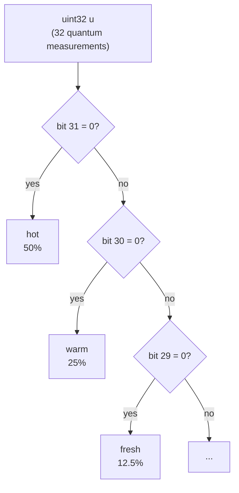
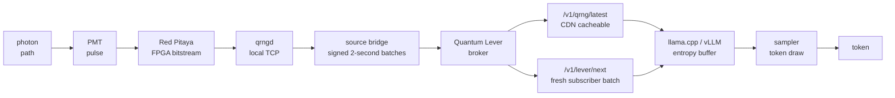

{: width="1672" height="941" }

*In* [*Part 1*](/posts/building-the-beam-universe-splitter/), I built a Quantum Random Number Generator out of a pair of old lab-equipment photomultiplier tubes, a 50:50 beam splitter, and an FPGA, and then capped it with a [*Quantum Magic 8-Ball*](/posts/building-the-beam-universe-splitter/#the-quantum-magic-8-ball). The 8-Ball was the *minimum viable Quantum Lever*: five quantum-derived bits per question -> twenty answers -> *twenty distinct macroscopic multiverse branches*. It pushes individual quantum events into macroscopic events like selecting *"Signs point to Yes"* on the Magic 8-Ball. But we are limited to just twenty canned responses...

*This is Part 2*: the plan here is narrow and practical: take the photon stream from Part 1 and in the spirit of Douglas Adams's [Infinite Improbability Drive](https://hitchhikersguidetoearth.fandom.com/wiki/Infinite_Improbability_Drive) *which passes through every conceivable point in every conceivable universe almost simultaneously*, this is the *finite* improbability drive. It will *drive an LLM through every reachable token sequence* with a Born weight my hardware can resolve, which is far fewer points but a lot more practical to build.

We will also hack llama.cpp/vLLM and convert regular large-language-model inference systems that sample randomly into steering wheels that drive us down all possible roads in the multiverse. This requires a few interesting hacks, to avoid deleting most of the potential multiverse branches.

Later, in Part 3 (*unpublished*), we'll unleash the Quantum Rig on the unsuspecting multiverse, armed only with a credit card and root access.

Here's what we'll cover: why the Many-Worlds Interpretation is the entire reason this rig is different from a fancy `/dev/urandom`, why every standard LLM sampler commits cosmicide, how to fix it with a probability *floor* and Galois fields to  to handle bias, how to wire the fixed sampler into llama.cpp and vLLM, and how to point your own local model at my photon beam-splitter device!

<!-- markdownlint-capture -->
<!-- markdownlint-disable -->
> **To be clear up front: This is NOT A QUANTUM COMPUTER.** No entanglement, no superposition of token sequences, no Grover's algorithm searching for the perfect sequence of LLM Tokens. The rig is a classical pipeline driven by single-event quantum measurements. Each token is selected based on which-detector-saw-the-photon. The branching happens because every measurement decoheres into its own world, not because anything is being computed in parallel.
{: .prompt-warning }
<!-- markdownlint-restore -->

---

## The Foundation: "I Choose MWI"

Everything in this series rests on one choice, so I am going to make it absolutely clear from the beginning:

I choose the [**Many-Worlds Interpretation**](https://en.wikipedia.org/wiki/Many-worlds_interpretation) (MWI) of how our universe operates. The wave-function never collapses. Every outcome with non-zero amplitude is realized in some decohered branch. I just need you to hold the stance long enough to see why it changes what an LLM sampler *is* in this interpretation. No quantum woo; just a viable and relatively common interpretation of the math of quantum mechanics.

### Just a Sec... Does Using QRNG Make Any *Measurable* Difference?

The obvious objection arrives immediately: *isn't quantum randomness just a fancy random number generator?*

***"Will I see spooky quantum stuff, be able to access parallel branches of the multiverse, or even see any tiny statistical difference to a regular random number generator?"***


We can very carefully perform statistical tests for randomness, as benchmarks like NIST STS *don't care where the bits came from*, but just that there are no patterns in the data. If you try comparing a billion QRNG-generated bits with a billion `/dev/urandom` bits and ask an omniscient classifier which is which, it can't tell. I ran 1.6 billion bits through the NIST suite in *Part 1* precisely to establish that there is "nothing to see" in the bits.

But the randomness we *see* in the bits is not the point. What the *apparent randomness* means is the key! That distinction is invisible if you only look at the bitstreams. It is invisible to your test suite. It is invisible to the LLM, for that matter. It is only meaningful *philosophically* if you take the MWI position of quantum mechanics as describing reality:

> Under MWI, when a single photon hits the beam splitter, both detector outcomes occur in parallel: in one branch PMT A fires, in another PMT B does. The ADCs digitize the pulses, the FPGA thresholds them to bits and assembles those bits into 32-bit words. Across the branches, the samplers sees *every possible* 32-bit number — and so *the model samples every possible token*, each in its own universe. The branches aren't a metaphor for the randomness; they're where the *apparent* randomness comes from. From inside any single universe, we see a number and some of us wonder why it was picked randomly. Step up to the multiverse perspective and we see it as it really is: there's a universe for each one! MWI matches the idea that "*God does not play dice with the universe*".

Part 3 of the series will cover the quantum mechanics properly, but one short and defensible reason to take MWI literally is [David Deutsch](https://en.wikipedia.org/wiki/David_Deutsch)'s challenge: a quantum computer with $N$ qubits manipulates $2^N$ complex amplitudes simultaneously. ***For 300 qubits that is more amplitudes than there are particles in the observable universe.*** Something physical is doing an enormous amount of work, and you should be able to *point at it*. Copenhagen says don't ask. Bohm says the guiding wave does it (*a wave that contains exactly the same branching structure MWI has...*). Many-Worlds simply says: the other branches are doing the work, they are as physically real as this one, and that is where the computational resources live. Whatever you think of the answer, the challenge is hard to dismiss.

But I am not committing to MWI because of Deutsch. I am committing to an entirely reasonable interpretation of quantum mechanics and pushing it to the logical extremes, because it's entertaining. You can pick from any of the mathematically valid interpretations of quantum mechanics you like; I choose interesting.

This post is committing to MWI and seeing what we can engineer:

> Under MWI, an LLM sampler driven by a QRNG is no longer just a text generator. Every token it *could* have emitted, it *does* emit, in some branch. The sampler is the map from branches to tokens — it decides which continuations exist anywhere in the multiverse, and with what measure.

---

## Why Use a Language Model At All?

*If the multiverse realizes every possibility, why use a language model? Just sample tokens uniformly from a Unicode range with quantum randomness. Every possible string exists somewhere in the wave-function, including all of Shakespeare, the perfect recipe for fried chicken and every winning lottery number in a row. Infinite monkeys, but real!*

The *bowling-ball problem* is stock example from undergraduate statistical thermodynamics: in principle, every air molecule beneath a bowling ball could happen to move upward at the same instant, and the ball would launch itself at the ceiling. But the probability mass on the boring outcome is so overwhelming that the exotic configurations never show up.

Uniform LLM token sampling has the same shape. The branch where randomly drawn Unicode produces a coherent essay exists, but its Born weight rounds to zero. Yes, the perfect answer is in there, but so every typo and every keyboard smash. Entropy reigns supreme in a uniform distribution.

A good LLM model has compressed an enormous amount of human reasoning into its next-token distribution. It bends probability mass toward continuations *that make sense*, while leaving some wiggle room for the weirdness. It drags the perfect outcomes out of the bowling-ball regime and into the merely *improbable*, where the photons can actually find them.

That is the entire reason a language model sits in the middle of a quantum-mechanics project. The photons provide the branching. The model provides the *weights* on the branching: it decides which of the reachable continuations are coherent enough to matter. The model is why this device makes the multiverse interesting instead of just generating mostly noise.



The lens works in both directions. The hot RL technique behind modern reasoning models is [GRPO](https://arxiv.org/abs/2402.03300): sample a strong model many times on the same hard problem, score the answers, reinforce the good ones. You already do this by hand: when you get a bad reply from a chatbot, just smash the retry button and (*hopefully*) get a better one. GRPO works because frontier models usually *know* the answer, they just don't cough it up on the first try.

So a Quantum LLM is, in this branch, indistinguishable from a regular LLM with a slightly more expensive RNG,  ***except philosophically***. Somewhere, for a sufficiently generous value of *somewhere*, a version of you just got the perfect answer. *You will almost certainly never be that version.*

---
## Cosmicide: How Standard Samplers Delete the Multiverse

A regular inference stack is not quantum-friendly out of the box. It needs some surgery first because a 250k-token vocabulary has a long and skinny tail. The bottom 100,000 tokens carry probabilities like $10^{-25}$. LLMs are trained with cross-entropy loss on *real examples*: for any given next-token position there were maybe a dozen or two valid targets in training, and what happens to the other ~249,990 tokens is simply not important to the loss. This shows up as a noisy floor of arbitrary tiny values.

So, standard inference samplers cleverly delete that part of the distribution, for good reasons:

- **`top_k`** keeps the top *k* tokens and deletes the rest
- **`top_p`** keeps the nucleus (probability mass) and deletes the tail
- **`min_p`** deletes anything below a threshold probability

> Temperature is conspicuously absent from the lineup: it rescales the distribution but never zeroes anything. Temperature is quantum-legal. Truncation is not.

These are all sensible for stopping a model from generating weird gibberish, but catastrophic for a Quantum LLM.

**Truncation is cosmicide.**

Every one of those sensible `top_k`-style options commits a tiny cosmicide. If the perfect token for some unlikely-but-real branch was at rank 151, `top_k = 150` erased that world from the entire multiverse. The photons got a vote, and the sampler rigged the election.

The fix is to keep every token reachable, so the right move is a probability *floor*, not a ceiling.

### The Floor: Keeping the Tail Alive

The trick is simple: we have $2^{32}$ slots for our logit CDF, right? If rounding minuscule probabilities kills tokens, we can instead guarantee each token a minimum number of slots. The sampler gives each token an integer number of slots proportional to its probability, scaled so the slots sum to $2^{32}$. Any token whose natural slot count would fall below $K$ gets *lifted* to $K$, and the resolved tokens are renormalized to fill the remaining space. Nothing in the deep vocabulary is unreachable!

This costs probability mass, a **multiverse tax**. At a vocabulary of 250k tokens and a [Zipf-shaped](https://en.wikipedia.org/wiki/Zipf%27s_law) distribution with slope $s \approx 1.8$, the headline numbers for $K = 64$ are:

|  $K$ | floor logprob | tokens lifted | original tail mass $$S_K$$ | floor mass $$F_K$$ | multiverse tax $$\Delta_K$$ |
| ---: | ------------: | ------------: | -------------------------: | -----------------: | --------------------------: |
| `64` |        −18.02 |       234,311 |                    0.0260% |             0.349% |                      0.323% |

{: width="1980" height="1276" }
_Where each floor value starts lifting the tail of a Zipf-shaped next-token distribution._

So about 0.3% of the probability mass is moved from probable tokens to the massively improbable. That is what it costs to keep the deep tail addressable. `K = 64` is large enough to absorb the measured detector imbalance and small enough that the tax stays below half a percent.

<details markdown="1">
<summary><strong>Click to expand: why the floor is set to K = 64</strong></summary>

The floor should not be arbitrary. It should be large enough that residual PMT imbalance cannot make a one-slot tail token effectively disappear.

The measured worst-case detector imbalance is about 55:45, so:

$$\delta = |2p - 1| \approx 0.1$$

Using a conservative raw-address bound, the minimum grain is:

$$K_{\text{bias}} = \left\lceil 121\left((1+\delta^2)^{32}-1\right) \right\rceil$$

For $\delta = 0.1$, this gives $K_{\text{bias}} \approx 46$. That sits below the hard design minimum of 64, so the default becomes $K = 64$.

The same calculation across plausible PMT imbalances:

| PMT ratio | $\delta$ | $K_{\text{bias}}$ |
| --------: | -------: | ----------------: |
|     51:49 |     0.02 |                 2 |
| 52.5:47.5 |     0.05 |                11 |
|     55:45 |     0.10 |                46 |
|     60:40 |     0.20 |               304 |
|     65:35 |     0.30 |             1,787 |
|     70:30 |     0.40 |            13,858 |

So the hardware is good enough that the design floor wins. If detector balance gets much worse, `K` rises. If `K` has to rise too far, the apparatus is no longer in the floor-fixable regime.

The full default also has to clear a hard minimum and any empirical floor from calibration:

$$K = \operatorname{next\_pow2}\left(\max\left(64,\; K_{\text{bias}},\; K_{\text{empirical}}\right)\right)$$

> rounded up to a power of two so the floor divides the $2^{32}$ address space cleanly.

where $K_{\text{empirical}}$ comes from hardware calibration: bit-position bias, autocorrelation, afterpulsing, periodic noise, replay tests, and coarse interval distortion.

</details>

<details markdown="1">
<summary><strong>Click to expand: the full floor-cost table</strong></summary>

|  $K$ | floor logprob | tokens lifted | original tail mass $$S_K$$ | floor mass $$F_K$$ | multiverse tax $$\Delta_K$$ | aggregate boost |
| ---: | ------------: | ------------: | -------------------------: | -----------------: | --------------------------: | --------------: |
|    1 |        −22.18 |        91,855 |                    0.0014% |            0.0021% |                     0.0007% |            1.5× |
|    4 |        −20.79 |       176,789 |                    0.0053% |            0.0165% |                     0.0111% |            3.1× |
|   16 |        −19.41 |       216,108 |                    0.0126% |            0.0805% |                     0.0679% |            6.4× |
|   64 |        −18.02 |       234,311 |                    0.0260% |             0.349% |                      0.323% |           13.4× |
|  128 |        −17.33 |       239,325 |                    0.0366% |             0.713% |                      0.677% |           19.5× |
|  256 |        −16.64 |       242,737 |                    0.0509% |             1.447% |                      1.396% |           28.4× |
|  512 |        −15.94 |       245,058 |                    0.0704% |             2.921% |                      2.851% |           41.5× |

The number that matters is $\Delta_K$, not the floor height: it is how much probability mass we actually moved, i.e. the total variation distance from the original softmax (assuming the added floor mass is taken proportionally from the resolved tokens).

</details>

The floor solves the *tail* problem. There is also a *head* problem, and it is subtler.

---


## Spreading the Address: The Head Problem

Consider the prompt:

> They ate the pizza while it was still ___

and imagine our model says the probabilities of the top 5 options for the next token are:

| token  | probability |            raw CDF range | binary pattern |
| ------ | ----------: | -----------------------: | -------------- |
| hot    |         50% |           [0,2147483648) | 0XXXXX...      |
| warm   |         25% | [2147483648, 3221225472) | 10XXXX...      |
| fresh  |       12.5% | [3221225472, 3758096384) | 110XXX...      |
| frozen |       6.25% | [3758096384, 4026531840) | 1110XX...      |
| cold   |      3.125% | [4026531840, 4160749568) | 11110X...      |

> Probabilities chosen adversarially to make the point — real distributions are messier, but directionally accurate

The decision "did we sample `hot`?" is just: *is the Most Significant Bit zero?* The same goes for the next few words down the list.



The fix does not change the probabilities, only the *geometry*. Insert a bijection $\pi : \text{uint32} \to \text{uint32}$ before the CDF lookup. With a perfectly uniform input, a bijection changes nothing at all: uniform in, uniform out, token distribution untouched. With a *biased* input (*which is what real detectors give you*), it is where the magic happens: a well-chosen $\pi$ makes each output bit a parity of many input bits, so the CDF boundaries no longer land on convenient bit-prefixes of the raw quantum sample.

The spreader I use is:

$$G = I + H + J$$

over GF(2) ([*Galois field*](https://en.wikipedia.org/wiki/Finite_field)), where:

- $I$ is the 32×32 identity matrix
- $J$ is the 32×32 all-ones matrix
- $H$ is the 32×32 Hadamard-character matrix:

$$H[i,j] = \operatorname{popcount}(i \mathbin{\&} j) \bmod 2$$

All arithmetic is XOR. Each row of $G$ is a 32-bit mask, and the corresponding output bit is the parity of $u$ restricted to that mask. Thirty-two precomputed masks, one parity per output bit.

I like visualizations, so let's try this on a smaller example with $2^{16}$ addresses, because there's a nice amount of detail (*$2^{32}$ looks like a smear...*).


*Black = 50% (32,768 codes), Yellow = 25%, Red = 12.5%, Green = 6.25%... Each color keeps the same cell count, so the probabilities are unchanged — but no bit is dominant.*

Four useful properties fall out:

- **Distribution preserving:** $G$ is a bijection on `uint32`, so uniform stays uniform.
- **No raw MSB dependence:** every output bit depends on at least 15 input bits.
- **Cheap:** a handful of instructions per word.
- **Auditable:** no seed, no magic table, one named construction.

For a parity of $k$ independent biased bits, the residual bias is $\delta^k$. At a 55:45 detector split, $\delta = 0.1$, and the minimum parity fan-in of 15 gives $0.1^{15} = 10^{-15}$, the detectors can be *visibly* lopsided, and after the spreader the head tokens are biased by one part in a quadrillion.

The spreader attacks the head of the distribution; the floor attacks the tail.

<details markdown="1">
<summary><strong>Click to expand: why this exact construction, the 8-bit toy, and self-inverse</strong></summary>

Each obvious simpler construction has a defect the next term fixes:

| Construction | Strength                | Defect                                             |
| ------------ | ----------------------- | -------------------------------------------------- |
| Raw CDF      | exact distribution      | contiguous MSB-dominated fibers                    |
| $J + I$      | high row weight         | rows nearly identical; half of inputs are fixed    |
| $H + I$      | diverse row masks       | row 0 is a direct wire: output bit 0 = input bit 0 |
| $I + H + J$  | diverse, no direct wire | linear, but that is the price of transparency      |

The row-weight distribution of $G$ is `{31: 1, 17: 16, 15: 15}`, averaging 16.5 — every output bit depends on at least 15 input bits, and by symmetry every input bit feeds at least 15 output bits. That 15-bit minimum drives the $\delta^{15}$ suppression.

The mechanism is easier to read at small scale. Here is the *same* construction built on 8 bits, applied to the first few addresses, with a third column showing the map applied twice:

|  $u$ | $G(u)$ | $G(G(u))$ |
| ---: | -----: | --------: |
|    0 |      0 |         0 |
|    1 |    254 |         1 |
|    2 |     87 |         2 |
|    3 |    169 |         3 |
|    4 |     55 |         4 |
|    5 |    201 |         5 |

Consecutive inputs scatter with no visible order — adjacent addresses no longer share high-order bits, which was the whole point. And $G(G(u)) = u$ everywhere: the map is **self-inverse** (`G² = I` over GF(2)). The same 32 masks encode and decode; run it twice and you regenerate the input, or you made a mistake (*handy for debugging!*).

**Fixed points.** A fixed point solves $(G + I)u = 0$ over GF(2). Computing the rank of $G + I$ by elimination gives rank 6, so the null space has dimension $32 - 6 = 26$: exactly $2^{26}$ fixed points out of $2^{32}$, about 1 in 64. That sounds alarming — 1.5% of quantum draws pass through unchanged? — but a fixed point is not a failure: those inputs form a 26-dimensional linear subspace, not a cluster of MSB-aligned addresses, so passing through unchanged does not concentrate them anywhere dangerous.

</details>

---
## The llama.cpp and vLLM Forks

The working implementations are [quantum-llama.cpp](https://github.com/dnhkng/quantum-llama.cpp) and [quantum-vLLM](https://github.com/dnhkng/quantum-vllm), forks of [llama.cpp](https://github.com/ggml-org/llama.cpp) and [vLLM](https://github.com/vllm-project/vllm). Both track their upstream projects while keeping the Quantum Lever integration isolated and reviewable. In the llama.cpp fork, the user-facing binary is called `quantum-llama-server`; the entropy and sampler implementation lives under `common/quantum/`. In the vLLM fork, the corresponding implementation lives under `vllm/quantum/` and the command is `quantum-vllm`. We can map it from photons generated in my basement to tokens generated on your local LLM rig:



There are two modes that operate slightly differently:

- **Free:** 
  - **`quantum_dist`** (`ql_day_` and `ql_week_` keys). Supplying `--quantum-api-key` replaces the normal sampler stack's final random draw with a 32-bit word from `/v1/qrng/latest`. The QRNG stream contains extracted, debiased, and whitened output from the photon apparatus. `top_k`, `top_p`, penalties, and the other ordinary samplers still work normally.
  - Computes the proportional distribution in double precision and apportions exactly `2^32` integer addresses using deterministic Hamilton largest-remainder allocation. It has no probability floor and no GF(2) spreader. Extremely small probabilities can therefore receive zero addresses. That is the principled resolution limit of using one 32-bit quantum word for one draw, rather than an accidental float32 underflow.
- **Subscriber:**
  - **`quantum_floor`** (`ql_lever_` keys). Adding `--quantum-sampler` enables the strict full-vocabulary Quantum Floor sampler. It uses raw which-path bytes from `/v1/lever/latest`, applies an optional local personalization transform, then an invertible GF(2) spreader, and finally performs an integer-CDF lookup with `K = 64` minimum slots per token by default.
  - The GF(2) spreader in `quantum_floor` should be understood as *diffusion*, not as a conventional entropy extractor. It mixes bit bias and short-range structure across the 32-bit selector while remaining bijective. It cannot delete an input address or create a new one. The floor provides the reachability guarantee: every token receives at least `K` addresses in the `2^32`-entry selector space.

Both do the same job, and will let your LLM generate outputs macroscopically across the multiverse. If you want:
 - The slightly more philosophically '*elegant*' version, using the GF(2) spreader and guaranteed 'fresh' photons
 - If you like this line of insane 'Rick-and-Morty-esque' projects and want to support more like it
then get the subscriber version. As I am lazy, maybe I'll just link this to the paid SubStack subscriber list at some point. Not sure; email me if you want to mess around with the free 'paid' subscription key. If 'paid' annoys you, no worries, I will be posting the VHDL code and you can build you own photonic coin-flip system from a few PMTs etc.

> In the next section below you will find the details on getting keys and compiling etc.

### Flags

Both servers accept these options:

```text
--quantum-api-key KEY
--quantum-api-url https://quantumlever.stream
--quantum-sampler
--quantum-k 64
--quantum-personalization "optional non-secret label"
--quantum-recv-timeout 2000
```

We *never* fall back to a software PRNG if the API is unavailable or malformed: no photon, no token!

The subscriber sampler also rejects options that can delete branches from the vocabulary:

- In quantum-llama.cpp it requires non-greedy temperature sampling, `--samplers temperature`, full vocabulary, no grammar constraint, no ignored EOS token, and no Mirostat.
- In quantum-vLLM it requires `temperature > 0`, `top_k` disabled, `top_p = 1.0`, `min_p = 0.0`, default presence/frequency/repetition penalties, no structured output or grammar constraint, no token allow-list, logit bias, bad-word filter, ignored EOS, or minimum-token constraint.
- Both quantum-vLLM modes reject speculative decoding because one quantum selector must correspond unambiguously to one sampling decision.

Temperature is the only setting allowed to reshape the `quantum_floor` distribution. Even then, every finite-vocabulary token retains at least `K` selector addresses.

## Personalization: One Photon Stream, Different Maps

The public entropy stream is shared. Clients requesting the same endpoint during the same batch receive the same bytes. If two clients also have the exact same model state, same processed probability distribution, same personalization setting, and the same word offset, they will address the same points in the same CDF and select the same tokens.

`--quantum-personalization` provides local decorrelation. The client deterministically derives a ChaCha20 key from the label, generates a keystream indexed by quantum-word position, and XORs each selector word with the corresponding keystream word. *The label is never sent to the API.*

This does not add entropy. For a fixed label and word index, XOR is a bijection on `uint32`: every input word maps to exactly one output word, and every output has exactly one input. A uniform input remains uniform. In the floor path the order is:

```text
raw Lever word -> optional personalization -> GF(2) spreader -> integer CDF
```

In the free path it is:

```text
whitened QRNG word -> optional personalization -> proportional integer CDF
```

The label is deliberately non-secret. It is a way to give users different deterministic maps over a shared public stream, not a cryptographic privacy mechanism. Use a name, session identifier, or label such as `branch-7-of-9`; leave it unset to consume the stream without local relabeling.

> There is a strange Many Worlds bookkeeping point buried in that shared stream. Everyone in this universe receives the same batch, but this universe is already one outcome of the measurements that produced it. Under MWI, the multiplicity is not primarily between users; it is between measurement branches. The sampler is the amplifier that turns a few buffered which-path bits into macroscopically different text, conversation, and future history.

That leaves a philosophically interesting timing choice. A client can use the latest completed batch, or it can announce its intent and wait for a batch produced after the request began.

The two modes make different choices:

- **free version** consumes the latest available QRNG batch. Its first selector may therefore come from photons measured *before the request began*.
- **subscriber version** fetches the current Lever batch only to identify and burn it, waits for the next distinct payload hash, and then starts sampling from that new batch. It adds lag, but guarantees the selector entropy was generated *after* the request began.

*The second choice has no statistical advantage*, but it makes the subscriber experiment literal: first ask the question, then wait for the measurement events that select the answer. Seems cool AF to me, but go with free if you like.

## Run It Yourself

The hardware is in my basement in Bavaria, but the quantum data stream is available over the internet.

Start at [quantumlever.stream/access](https://quantumlever.stream/access). There are two free key types and one subscriber tier:

- **Day key** (`ql_day_`): issued after a browser CAPTCHA without email and valid for 24 hours. It is shown once, cannot be recovered, and another can be created after the five-minute cooldown.
- **Week key** (`ql_week_`): issued after a six-digit email verification code and valid for seven days. The reset option revokes older keys for that email before issuing a replacement.
- **Lever key** (`ql_lever_`): issued through the same email verification flow when the address has a subscriber or complimentary entitlement. It is normally valid for 30 days, although manually issued durations can differ.

All key types can use the whitened QRNG stream. Only a Lever key has the `lever` and `quantum_sampler` capabilities required for the raw stream and strict floor sampler.

<!-- markdownlint-capture -->
<!-- markdownlint-disable -->
> **The stream and access keys are not secrets suitable for cryptographic use.** They are for sampling and experiments. Do not use this service to generate passwords, private keys, session secrets, or any value whose confidentiality matters. Everyone in *your particular branch of the multiverse had access to your bits!*
{: .prompt-warning }
<!-- markdownlint-restore -->

### quantum-llama.cpp
<details markdown="1">
<summary><strong>Click to expand: Compiling quantum-llama.cpp</strong></summary>

quantum-llama follows llama.cpp's normal hardware requirements:

```bash
git clone https://github.com/dnhkng/quantum-llama.cpp.git
cd quantum-llama.cpp
cmake -B build -DCMAKE_BUILD_TYPE=Release -DLLAMA_OPENSSL=ON
cmake --build build --config Release -t quantum-llama-server -j
```

HTTPS support is enabled by default, but it requires OpenSSL 3 development files to be available when configuring the build. Keeping `-DLLAMA_OPENSSL=ON` explicit makes that requirement visible: the sampler must be able to contact `https://quantumlever.stream`.

The binary is normally `build/bin/quantum-llama-server`. Multi-configuration Windows builds may place `quantum-llama-server.exe` under `build/bin/Release/`.

Set paths for your model and key:

```bash
export MODEL=/absolute/path/to/model.gguf
export QUANTUM_API_KEY=ql_day_REPLACE_ME
```

Start the free `quantum_dist` mode:

```bash
./build/bin/quantum-llama-server \
  --model "$MODEL" \
  --host 127.0.0.1 \
  --port 8080 \
  --quantum-api-key "$QUANTUM_API_KEY" \
  --quantum-personalization "my-local-session"
```

This keeps the ordinary llama.cpp sampler stack. You can continue to use temperature, `top_k`, `top_p`, `min_p`, and other standard sampling controls.

For a subscriber key, start strict `quantum_floor` mode:

```bash
export QUANTUM_API_KEY=ql_lever_REPLACE_ME

./build/bin/quantum-llama-server \
  --model "$MODEL" \
  --host 127.0.0.1 \
  --port 8080 \
  --quantum-api-key "$QUANTUM_API_KEY" \
  --quantum-sampler \
  --quantum-k 64 \
  --quantum-personalization "my-local-session" \
  --samplers temperature \
  --temp 0.8
```

Do not add grammar constraints, Mirostat, `--ignore-eos`, or truncation samplers to that command.

Test either server through its OpenAI-compatible endpoint:

```bash
curl http://127.0.0.1:8080/v1/chat/completions \
  -H 'Content-Type: application/json' \
  -d '{
    "messages": [
      {"role": "user", "content": "Write one sentence about a beam splitter."}
    ],
    "temperature": 0.8,
    "max_tokens": 64
  }'
```

The first floor request normally pauses until the next two-second Lever batch closes. That delay is intentional.

</details>

### quantum-vLLM
<details markdown="1">
<summary><strong>Click to expand: compiling quantum vLLM</strong></summary>

quantum-vLLM follows vLLM's normal hardware requirements. Install the fork into a uv-managed environment:

```bash
git clone https://github.com/dnhkng/quantum-vllm.git
cd quantum-vllm
uv venv
source .venv/bin/activate
uv pip install -e .
```

On Windows PowerShell, activate with `.venv\Scripts\Activate.ps1`.

Before loading a model, smoke-test a free key:

```bash
quantum-vllm --quantum-api-key ql_day_REPLACE_ME
```

Smoke-test the subscriber path with:

```bash
quantum-vllm \
  --quantum-api-key ql_lever_REPLACE_ME \
  --quantum-sampler
```

The subscriber test waits for a fresh Lever batch before printing its word.

Start an OpenAI-compatible server in free mode:

```bash
quantum-vllm serve YOUR_HUGGING_FACE_MODEL \
  --quantum-api-key ql_day_REPLACE_ME \
  --quantum-personalization "my-local-session"
```

Or start strict floor mode:

```bash
quantum-vllm serve YOUR_HUGGING_FACE_MODEL \
  --quantum-api-key ql_lever_REPLACE_ME \
  --quantum-sampler \
  --quantum-k 64 \
  --quantum-personalization "my-local-session"
```

Then make a floor-compatible request:

```bash
curl http://127.0.0.1:8000/v1/chat/completions \
  -H 'Content-Type: application/json' \
  -d '{
    "model": "YOUR_HUGGING_FACE_MODEL",
    "messages": [
      {"role": "user", "content": "Write one sentence about a beam splitter."}
    ],
    "temperature": 0.8,
    "top_k": 0,
    "top_p": 1.0,
    "min_p": 0.0,
    "presence_penalty": 0.0,
    "frequency_penalty": 0.0,
    "repetition_penalty": 1.0,
    "max_tokens": 64
  }'
```

The OpenAI-compatible completion, chat-completion, and Responses endpoints also accept per-request `quantum_floor` or `quantum_dist` objects, plus the flat compatibility fields `quantum_api_key`, `quantum_api_url`, `quantum_sampler`, `quantum_personalization`, `quantum_k`, and `quantum_recv_timeout`. Server-level flags are simpler for a private local server; request-level parameters are useful when a service deliberately supports both classical and quantum requests.

If a floor request is rejected, read the error literally. The implementation fails closed when a setting would truncate or mask the vocabulary. Remove the named sampler, penalty, constraint, or speculative-decoding option rather than trying to force the request through.

</details>

## Conclusion

<!-- markdownlint-capture -->
<!-- markdownlint-disable -->
> **This last section was entirely generated by GLM-5.2 (*because I can...*) running on quantum vLLM, on my GH200 rig**. I gave it a list of bullet points to cover, and copy-pasted it over directly without edits. You will be reading it from one of the ~$10^{4671}$ parallel macroscopically different universes generated.
{: .prompt-warning }
<!-- markdownlint-restore -->


---

Part 2 has presented a language model in which every next token is selected not by a pseudorandom number generator, but by a physical which-path measurement: a single photon strikes a beam splitter, one of two photomultiplier tubes fires, and the resulting bit-level decision propagates through a 32-bit selector into a token in the model's vocabulary. The photons do the branching; the model does the weighting.

Two mechanisms in the standard inference stack routinely discard the outcomes that branching was supposed to preserve. Both have been replaced. At the top of the distribution, truncation samplers — `top_k`, `top_p`, `min_p` — silently delete tokens whose probabilities fall below a threshold; these have been replaced by a probability **floor** that guarantees every vocabulary token a minimum number of address slots, so no token is unreachable regardless of how small its Softmax probability. At the bottom of the distribution, floating-point rounding in the integer-CDF allocation can assign zero slots to extremely low-probability tokens, effectively deleting them; this has been addressed not by raising precision but by inserting a GF(2) **spreader**: a bijective linear transform that redistributes bit-level bias across the full 32-bit selector space without altering the token probabilities themselves.

Together, the floor and the spreader ensure that every branch the photons could physically reach is preserved in the mapping from quantum measurements to tokens. No world is deleted by the sampler. The multiverse tax — roughly a third of a percent of probability mass at the default floor — is the cost of keeping the entire vocabulary addressable.

And yet, in this branch, the system produces completely ordinary text. Run it through any statistical battery, compare its output to the same model sampling from `/dev/urandom`, and no test can tell them apart. The NIST randomness suite cannot distinguish the bitstreams. The LLM cannot tell you it is being driven by photons. The generated prose reads like prose.

That result is not a disappointment. It is the entire point.

The difference this rig makes is not found in the bits themselves — they are, by every measurable criterion, just random bits. The difference lies in what those bits physically represent: genuine quantum measurement outcomes, each corresponding to a real decoherence event in which a photon took one path in this branch and another path in a branch we will never access. And the difference lies in the interpretation applied to them: under the Many-Worlds Interpretation, every token the model could have emitted was emitted, in some branch, weighted by the Born rule, driven by a photon that genuinely went both ways. The sampler did not pick a token at random. It mapped a branch to a future.

In Part 3, the Many-Worlds Interpretation receives a fuller historical defence — not as a fringe curiosity, but as one of the most defensible readings of the quantum formalism available, backed by decades of argument from Deutsch, Wallace, Carroll, and others. Then the Quantum Lever leaves the laboratory. The same floor-and-spreader sampler is connected to an autonomous agent with no human in the loop. The agent receives a $50 budget and access to a prediction-market account. Whatever it does — every trade it places, every strategy it pursues, every token it commits to a decision — will be driven by photons measured in a basement in Bavaria, branching across the multiverse, one measurement at a time.

Some version of that agent will make the right call. Most will not. We will only ever see the one we are in.

## Addendum

The conclusion about a bit over 900 tokens. As across the multiverse all 155,000 vocabulary tokens of GLM-5.2 were used at every one of the 900 positions, the number of possible token sequences—or macroscopically divergent “worlds”—is:

$$ 
155{,}000^{900} \approx 1.99 \times 10^{4671}
$$ 

You read this uniquely LLM generated conclusion from one of the roughly $10^{4671}$ possible worlds.