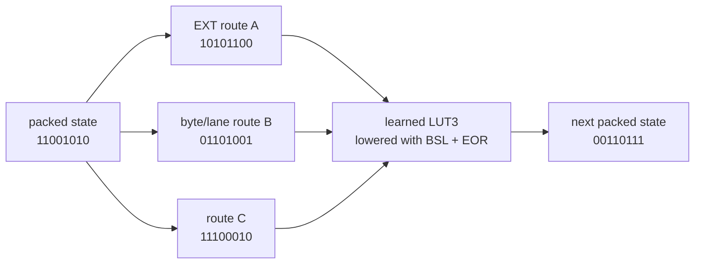
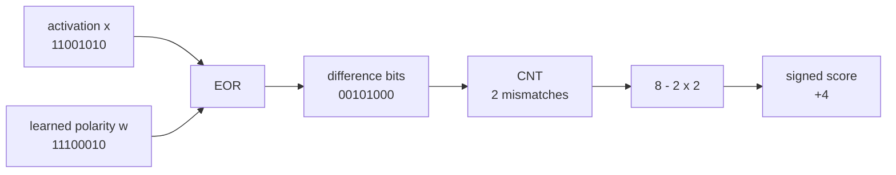
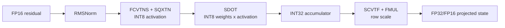
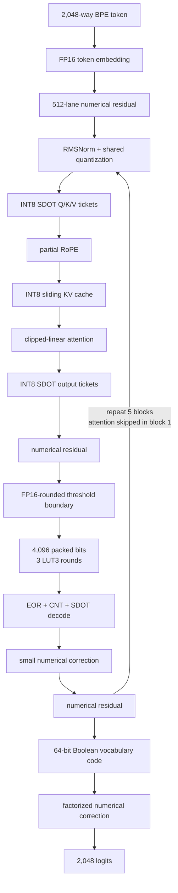

## Introduction

Language models are designed in linear algebra, PyTorch functions, and translated onto hardware afterwards. You pick an architecture, then you bend CUDA, Metal, or BLAS to your will to run it, hoping the compilers will do a good job with graph optimisation.
An ARM core already contains a pile of very fast operations that nobody invented for language models. It compares floating-point lanes in parallel, shuffles bytes inside vector registers, XORs packed bit patterns, counts set bits, takes groups of signed 8-bit dot products, and widens half-precision products into FP32 accumulators. Decades of cryptography, codec and signal processing work paid for that highly optimised silicon, and now we are going to have some fun hacking it into something new.

What does a language model look like if the instruction set is part of the architecture, and we let competing instructions battle it out, with the loss curve deciding which instructions survive?

The current answer is a 5-layer, 512-wide TinyStories model with 3,531,795 deployed learned values and a 3,265,024-byte weight image. Weights plus a full 256-token KV allocation come to 3.36 MB, which stays resident in the L2 of the Performance Core it decodes on, generates at a median **20,882 tokens/second**, and reaches **0.8786 bits per byte** in the native binary on the same validation slice as the framework evaluation.

It is not a Boolean network, but a hybrid built from ARM instructions:

* FP16 residual state and normalisation
* INT8 `SDOT` attention projections
* a learned Boolean feed-forward program built from *compare, route and logic ops*
* `CNT`/`SDOT` signed-popcount decoding
* RoPE with an incremental KV cache
* a clipped-linear attention normaliser with *no exponentials*
* a Boolean vocabulary code with a small numerical correction path

> You can see the model and code here: https://github.com/dnhkng/M4-TinyStories

---

## An instruction is a small fixed function

A neural network layer is a parameterised function. So is an instruction, except that its shape, precision and data movement are etched in silicon.

A 128-bit Neon register holds sixteen INT8 values, eight FP16 values, four FP32 values, or 128 individual bits. These functions can get cheaper based on the data types you're using, and for what. In FP16 the register is good for normalisation, residual arithmetic and small corrections. In INT8, `SDOT` consumes four products per 32-bit lane and accumulates into INT32. As packed bits, one register carries 128 binary features through `EOR`, `BSL`, `EXT` and `CNT`.

The working hypothesis was that a good small language model might be a program that deliberately moves between these representations, spending time in each only where the CPU has a strong primitive.

Here is the full set I played around with. Most of these appear later in the post; a few were tested and rejected. All operate on 128-bit Neon registers unless noted.

**Logic and bit manipulation**

| Instruction    | What it does                                         | Used for                                                   |
| -------------- | ---------------------------------------------------- | ---------------------------------------------------------- |
| `EOR`          | bitwise XOR                                          | Boolean logic rounds; disagreement marking before popcount |
| `BSL`          | bit select — pick bits from two sources under a mask | lowering learned 3-input truth tables                      |
| `EXT`          | extract a byte window spanning two registers         | routing bits between Boolean rounds                        |
| `CNT`          | count set bits in every byte                         | turning packed bits back into small integers               |
| `UADDLV`       | widen and sum all lanes to a scalar                  | reducing `CNT` output (Boolean attention experiments only) |
| `TBL2`         | table lookup across two registers                    | product-codebook experiments; not in the final model       |
| `BCAX`, `EOR3` | fused three-way XOR/AND-XOR (crypto extension)       | alternative Boolean cells; rejected                        |

**Integer arithmetic and dot products**

| Instruction | What it does                                                       | Used for                                                    |
| ----------- | ------------------------------------------------------------------ | ----------------------------------------------------------- |
| `SDOT`      | four signed 8-bit products per 32-bit lane, accumulated into INT32 | every dense projection; reducing groups of popcounts        |
| `SMMLA`     | signed 8-bit matrix multiply-accumulate                            | batch-one shape can't use it; noted for future batched work |
| SME2 / `ZA` | scalable matrix extension with its own accumulator tile            | tested for the matvec path, substantially slower here       |

**Floating point and conversion**

| Instruction       | What it does                                              | Used for                                                              |
| ----------------- | --------------------------------------------------------- | --------------------------------------------------------------------- |
| `FCMGE`           | lane-wise compare, produces an all-ones or all-zeros mask | the threshold boundary that creates Boolean features                  |
| `FMAX`            | lane-wise maximum                                         | max-centering and clipping in the attention normaliser                |
| `FMLA`            | fused multiply-add                                        | numerical corrections; attention accumulation                         |
| `FMLAL`, `FMLAL2` | multiply FP16 lanes, accumulate into FP32                 | readout and FP16 matvec, where FP16 accumulation would lose precision |
| `FMUL`, `FADD`    | multiply, add                                             | row scaling, residual updates                                         |
| `FCVTN`, `FCVTL`  | narrow FP32→FP16, widen FP16→FP32                         | the FP16-rounded boundary before thresholding                         |
| `FCVTNS`, `SQXTN` | float→int with rounding, then saturating narrow           | quantising activations to INT8 for `SDOT`                             |
| `SCVTF`           | int→float                                                 | converting INT32 accumulators back to floating point                  |

`FCMGE` is how numbers become bits, and `EOR`+`CNT` is how bits become numbers again.

Every group followed the same loop: pick a primitive, expose it as a trainable operation, train against next-token loss on a fixed data order and seed, read the validation curve, export the exact native representation, and measure bytes and tokens per second on the M4. Anything that failed either gate was stopped. Three-seed calibration put the late endpoint spread at 0.00356 bpb, which is small enough that multi-point curve shape is usable and single-point leads usually are not.  Relatively rigorous, and still only a weekends worth of Laptop compute.

---

## Dataset and metric

I used the official TinyStories V2 GPT-4 release from [Eldan and Li](https://arxiv.org/abs/2305.07759): 2.228 GB of training text, 22.5 MB of validation text. A lossless byte-level BPE tokeniser with a 2,048-entry vocabulary reduces the training side to 502,972,439 tokens.

The metric is bits per decoded byte:

$$
\mathrm{bpb} = \frac{\sum_i -\log p(t_i \mid t_{<i})}{\ln(2)\,\sum_i \mathrm{bytes}(t_i)}
$$

Bytes in the denominator matter as soon as tokenisation or the vocabulary path changes. Token-level cross-entropy flatters a tokeniser that packs more characters into each target. BPB asks how many bits are needed to encode the original text, which is the question I actually care about.

Generated stories were saved at every gate, but only as pathology diagnostics. A tiny model will happily produce one charming sample while having a worse distribution everywhere else, and early in this project the correlation between loss and prose quality was negative: at 1M parameters, the checkpoint with the best bpb had greedy repeated-8-byte mass of 0.419 against 0.275 for the earlier one. Selection therefore runs off the curves.

---

## From floating-point state to bits: `FCMGE`

The Boolean feed-forward block starts from the FP16 residual. Learned offsets turn residual channels into threshold tests, lowered to a vector floating-point compare:

$$
b_i = [x_{r(i)} \ge \theta_i]
$$

where $r(i)$ is an ISA-cheap routing of a residual channel and $\theta_i$ is learned. The real block produces 4,096 Boolean features from the 512-channel residual stream.

*This is not post-training quantisation.* The thresholds and the Boolean program downstream are trained together, so the numerical representation learns to put its useful decisions where `FCMGE` can find them. The boundary is FP16-rounded during training as well: if the deployed program makes a hard representation decision, hiding that decision from the optimiser buys a quality cliff at export.

---

## A feed-forward network made of register logic

A conventional FFN expands the residual through two dense matrices with a nonlinearity between them, which in a small decoder is most of the weights and most of the memory traffic. The Boolean FFN expands to packed bits instead, runs three rounds of learned three-input logic, and decodes selected traces back into the numerical residual.

The native operations are: `EXT` moves byte windows between registers, `BSL` selects bits from two sources under a mask, `EOR` does XOR, `CNT` counts set bits per byte, `SDOT` reduces groups of signed counts, and `FMLA` applies the numerical correction. Arm's [Advanced SIMD documentation](https://developer.arm.com/documentation/101028/latest/Advanced-SIMD--Neon--intrinsics) lists them as ordinary packed integer, logical and dot-product instructions. The only unusual part is asking gradient descent to organise a language model around them.

One simplified logic round:



In the hard forward pass each output bit follows a learned truth table. Training uses a straight-through/hybrid gradient. The approximation lives in the optimiser, not in the deployed program: inference executes the hard bit decisions.

I also tried direct XOR and `BCAX`-style cells, and a more heavily factorised minterm cell carried over from earlier CIFAR work. These were reasonable candidates because a cheaper cell can win on speed even when its loss is slightly worse. None of them changed the curve. The factorised minterm cell tracked LUT3 within noise and was 1.96× slower in the isolated Boolean core (1,025 ns versus 523 ns per packed route-and-cell call), and the shallow-wide dual3 variant was 0.023 bpb worse at 1M bytes with no cost advantage. The general three-input program, lowered through `BSL` and `EOR`, stayed.

### Routing

A Boolean layer with no routing keeps recombining the same neighbours, and depth stops spreading information across the register file. Arbitrary permutations fix that mathematically and can cost more than the logic they feed.

The final routes are restricted to transformations that are cheap in the ISA: byte extraction, lane-local rearrangement, register mixing. Layout is part of the learned architecture, so the model trains from the get go the layout it will execute, instead of paying at runtime to transpose into a prettier one.

---

## `EOR` + `CNT`: dot products hiding inside popcount

Packed features are only useful if they can get back into a numerical stream cheaply. For binary vectors, XOR marks disagreement and popcount counts it, so an agreement score falls straight out:

$$
\mathrm{score}(x,w) = N - 2\,\mathrm{popcount}(x \oplus w)
$$



The native path does many of these at once: `CNT` gives per-byte counts, `SDOT` and integer arithmetic reduce groups into signed features, and a small INT8/FP32 correction maps those features back into the 512-dimensional residual.

This interface worked far better than making attention itself Boolean. Bits are good at producing a wide, cheap, nonlinear feature basis. Numerical channels are good at carrying magnitude, geometry and fine corrections.

---

## `SDOT`: the numerical backbone

Attention still needs numerical projections, and on M4 those are W8A8 matrix-vector products built around `SDOT`. Each activation vector is normalised, quantised once, and reused wherever projections share an input. Weight rows are stored in the order the kernel consumes them.



QKV uses prepacked 8×16 hardware tickets. The attention output uses prepacked 16×16 tickets and keeps half the possible blocks. The sparsity is structural: a missing ticket removes an entire unrolled SIMD block. Scattered zeros are not a speed feature when the CPU still loads the vector and issues the instruction.

---

## Attention without `exp`

I built a Neon `exp2` approximation and it worked, but the selected model goes further and uses head-calibrated clipped-linear attention:

$$
u_i = \max\left(0, 1 + a_h(s_i - \max_j s_j)\right), \qquad
w_i = \frac{u_i}{\sum_j u_j}
$$

The slope $a_h$ is learned per head. Max-centering gives the best item a numerator of exactly one, and scores far enough below the maximum become exactly zero. The native path is `FMAX`, `FMLA`, reductions and reciprocal refinement.

Attention is hardware-shaped in one more way: fifteen of the sixteen heads use a 32-token local window and one head stays global over the 256-token context. Keys are stored as fixed-scale INT8, and the shared value head uses a fixed weight-RMS INT8 scale. Short local windows cut cache traffic and score work without losing the global path.

---

## The whole block

The token path is two representations meeting repeatedly:



| Component                | Selected form                                  |
| ------------------------ | ---------------------------------------------- |
| Blocks                   | 5                                              |
| Residual width           | 512                                            |
| Attention heads          | 16: 15 local, 1 global                         |
| Q/K head width           | 16                                             |
| Context                  | 256 tokens                                     |
| Position                 | RoPE on half the Q/K dimensions                |
| KV                       | fixed-scale INT8 keys, shared INT8 value head  |
| Attention normaliser     | learned clipped-linear                         |
| Attention projections    | INT8 `SDOT`, prepacked block tickets           |
| Boolean FFN              | 4,096 bits, 3 LUT3 rounds                      |
| FFN correction interface | 416 state-rotated features                     |
| Vocabulary               | 2,048-token Boolean hybrid, rank-64 correction |

One attention layer is skipped entirely, and layers 3 and 4 reuse the same saved attention input while keeping their own residual and FFN updates. Both remove work from the graph rather than making an unchanged graph faster.  These optimisations were found via trial and errors, and many such trips were needed to hit the tiny target.

---

## Backprop through a truth table

At inference, every LUT3 cell is a lookup: index an eight-entry table with $4a + 2b + c$ and read one bit. The derivative of a lookup is zero almost everywhere and undefined at the threshold, so backprop gets nothing from it. Training needs a stand-in for the missing gradient, and the code ends up using different stand-ins in different parts of the graph. For the cells themselves, `boolean_backward` selects between `ste`, `multilinear`, `softened` and `hybrid`.

The usual answer in binary networks is the straight-through estimator (STE): treat the gate as the identity on the way back and pass the gradient through unchanged. Training doesn't stall, but every input is told it mattered, including inputs the cell's table ignores.

### Exact sensitivity from the table

Any three-input Boolean function has a unique multilinear extension, a polynomial on $[0,1]^3$ that is linear in each variable and matches the table $t$ at all eight corners. Its derivative with respect to $a$ is

$$
\frac{\partial f}{\partial a} = (t_4 - t_0)(1-b)(1-c) + (t_5 - t_1)(1-b)\,c + (t_6 - t_2)\,b\,(1-c) + (t_7 - t_3)\,b\,c
$$

and likewise for $b$ and $c$. In the forward pass $b$ and $c$ are hard bits, so three of the four terms are zero and the derivative reduces to

$$
\frac{\partial f}{\partial a} = f(1,b,c) - f(0,b,c)
$$

That asks whether flipping $a$ would have changed the output, with $b$ and $c$ held where they are. The answer is $-1$, $0$ or $+1$, read straight off the table. STE answers $1$ every time.

The zeros are a problem. An AND-like cell is insensitive to $a$ whenever $b = 0$, which is correct, but if enough cells sit in that state for a batch, large parts of the network stop learning. The `hybrid` mode, which the selected model uses, keeps the exact derivative and replaces zeros with a leak of 0.05: the leaky-ReLU trick, applied to a truth table. `softened` takes another route and pulls the hard bits towards 0.5 with a temperature-scaled sigmoid before evaluating the same formula, so all four terms contribute. It is smoother, and no longer exact at the corners.

### Training the table

The table entries are learned too. Each cell has eight logits, thresholded at zero in the forward pass, with the same sigmoid-derivative surrogate the `FCMGE` thresholds use on the way back. Getting the gradient to the right entry needs no approximation. A lookup isn't differentiable with respect to its address, but it is with respect to the value stored there, so the output gradient goes to the one entry that was read and the other seven get nothing.

The logits are initialised at $-0.02$ with a standard deviation of 0.01, so about 98% of entries start at 0 and about 83% of cells start as the all-zero table. XORing a zero branch into the state does nothing, which means the Boolean FFN starts close to a no-op, and each cell has to earn its way into changing the state. `noop_program_fraction` in the training diagnostics counts how many haven't yet.

### The residual XOR

Each round XORs the cell outputs back into the Boolean state. XOR has an exact derivative as well, $\partial(a \oplus b)/\partial a = 1 - 2b$, and it's in the code, but the FFN's residual XOR doesn't use it: whatever `boolean_backward` says, the gradient crosses each residual XOR unchanged. The exact form would flip the gradient's sign wherever the branch bit is 1; the identity keeps the sign intact through all three rounds.

### Keeping the bits balanced

A table only learns the entries that get read. If the Boolean state drifts towards all zeros, most cells keep reading entry 0 and the other seven stop receiving gradient; a state near all ones does the same with entry 7. A bit stuck at one value also tells the decoder nothing. So the objective adds a small balance penalty, the squared distance of the fraction of set bits from 0.5, measured after encoding and after every round, with a weight of 0.001.

---

## The native program

Deployment is a standalone macOS binary with embedded weights. The exporter freezes the Boolean programs, quantises the numerical matrices, packs the live hardware tickets, emits shape constants and builds the weight image. The ABI is generic across widths, head geometries, correction ranks, skipped layers and shared-source layouts, so all three allocation arms above compiled without a new kernel or a per-shape specialisation.

| Stage            | Main instructions                                                |
| ---------------- | ---------------------------------------------------------------- |
| Embedding        | packed addressing, `EOR`, `SCVTF`, `FMUL`                        |
| Dense attention  | `FMAX`, `FCVTNS`, `SQXTN`, `SDOT`, `SCVTF`, `FMUL`               |
| Boolean boundary | `FCVTN`, `FCVTL`, `FCMGE`                                        |
| Boolean program  | `EXT`, `BSL`, `EOR`                                              |
| Boolean decode   | `CNT`, `SDOT`, `FMLA`                                            |
| Readout          | `EOR`, `CNT`, `SDOT`, `FMLAL`, `FMLAL2`, `FADD`                  |
| KV               | fixed-scale INT8 stores, `SDOT`, `FMLA`, integer ring addressing |

`FMLAL`/`FMLAL2` multiply FP16 lanes while accumulating into FP32, which is what makes the readout and the compatible FP16 matrix-vector paths work: the weights stay compact but long sums do not inherit an FP16 accumulator. The dense attention projections use `SDOT` instead. Hand-written assembly survives alongside the C++/Neon kernels — the row-major `m4_story_matvec_fmlal.S` schedule uses independent weight streams and FP32 accumulation, while the Boolean FFN, routes, INT8 projections, attention and readout are driven by generated shape and layout data.

### The residency budget

|                   |     Bytes |
| ----------------- | --------: |
| Weight image      | 3,265,024 |
| Full 256-token KV |    99,840 |
| Resident total    | 3,364,864 |
| Budget            | 4,194,304 |
| Headroom          |   829,440 |

Some care is needed about which cache this is. `hw.l2cachesize` reports 4,194,304 bytes on my M4 Pro, but that is the efficiency cluster; the performance cluster reports 16 MB in `hw.perflevel0.l2cachesize`. The decoder is single-threaded and runs on a performance core, so 4 MiB is not a hardware limit here. It is the residency target I chose to design against, and this model uses 80.2% of it so I can fit in the KV cache too.

Apple quotes 273 GB/s of unified memory bandwidth on M4 Pro, but peak DRAM bandwidth is not what this is about. The bandwidth the L2 cache delivers is terabytes-per-second, running at core processor frequency with a latency of roughly 10–20 clock cycles.

---

## Results

Same first 256 validation windows, same 65,536 targets:

| Execution               | Validation bpb |
| ----------------------- | -------------: |
| H100 checkpoint record  |   **0.878355** |
| Independent PyTorch/MPS |       0.878490 |
| Native M4 binary        |       0.878630 |

The binary's three-run 100k-token median is **20,882 tokens/second**. I report tokens rather than characters because different greedy streams decode to different byte counts. Over a broader 512-window slice the native binary scores 0.864575 bpb; that is a separate measurement, not a comparison against the numbers above.

### A sample

Fixed seed, from the native binary:

> One day, Lily went to the park to play. She saw a big tree and wanted to pick it up. Lily picked up the tree and put it in her mouth.
>
> Lily asked the squirrel, "Can I have on the tree too?" Lily said, "No, it is mine!" So they played in the park until the sun went down. The squirrel was very dependaged to be clean.

Character, scene, dialogue, causal continuity, a girl eating a tree, and the word "dependaged". This is evidence that the model does not emit `the the the`. It is not why the architecture was selected.

---

## Conclusion

XOR, bit select, byte routing and popcount can form a real learned nonlinear program. `SDOT` gives it a compact numerical backbone. A clipped linear normaliser removes the exponentials, provided the model trains around it. RoPE turns cacheability from an optimisation into an invariant. Structural ticket sparsity removes real instructions, provided the learned layout respects the register schedule.

The best final model used numerical residuals, numerical attention geometry and numerical correction channels around a wide Boolean FFN, and learned which parts of the computation could survive compression to bits. The instruction set did not abolish the Transformer; it changed the cheapest useful division of labour inside one.

An M4 will now tell a coherent, slightly deranged children's story at about twenty thousand tokens per second, from a model that sits in cache next to its own KV. The 4 MiB budget was a conservative choice; the performance cluster has sixteen. A version built to spend that is training now, and will follow as an addendum.

---

## References and reproducibility

* Ronen Eldan and Yuanzhi Li, [TinyStories: How Small Can Language Models Be and Still Speak Coherent English?](https://arxiv.org/abs/2305.07759)
* Jianlin Su et al., [RoFormer: Enhanced Transformer with Rotary Position Embedding](https://arxiv.org/abs/2104.09864)
* Arm, [Advanced SIMD/Neon intrinsics](https://developer.arm.com/documentation/101028/latest/Advanced-SIMD--Neon--intrinsics)
* Apple, [M4 Pro and M4 Max](https://www.apple.com/newsroom/2024/10/apple-introduces-m4-pro-and-m4-max/)

You can train the model from the repo:
[https://github.com/dnhkng/M4-TinyStories](https://github.com/dnhkng/M4-TinyStories)

## Citing This Work
```bibtex
@article{ng2026m4tinystories,
  title   = {Teaching an M4 CPU to Tell Stories with XOR, Popcount and SDOT},
  author  = {Ng, David Noel},
  year    = {2026},
  month   = {September},
  url     = {https://dnhkng.github.io/posts/m4-tinystories/}
}
```
{: .nolineno }